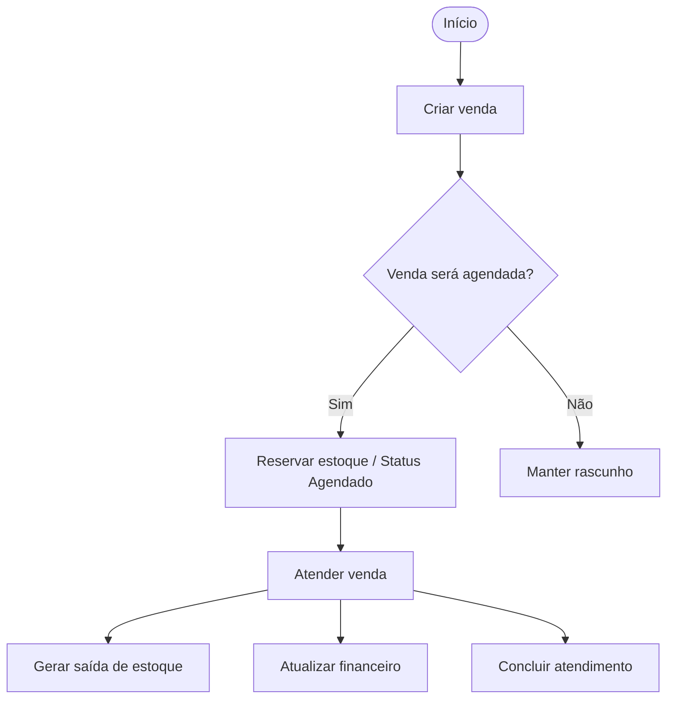
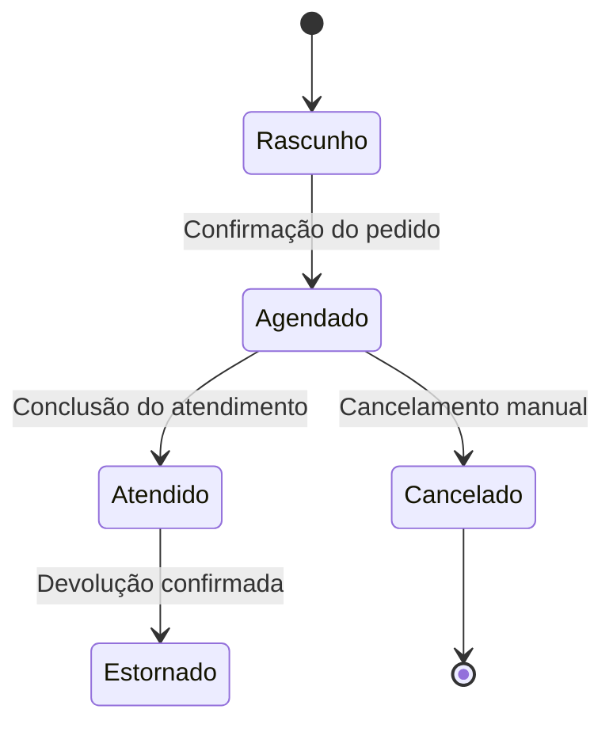
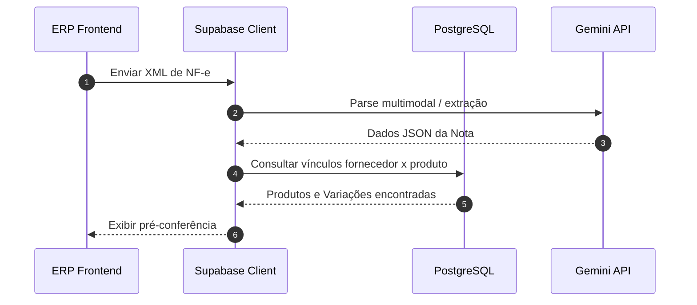
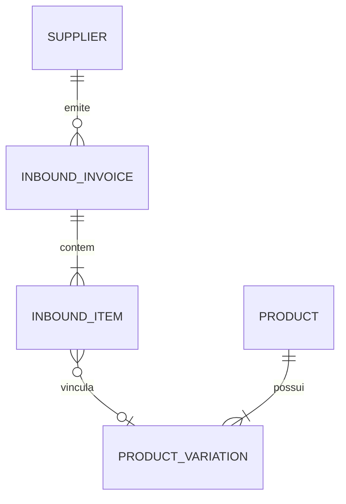

# Skill: Modelagem de Negócio, Arquitetura Funcional e Documentação Visual Profissional

Esta skill é a **autoridade permanente** sobre como o negócio do Morante Hub funciona, como os módulos cooperam e como essa inteligência é representada de forma viva, estruturada, navegável e profissional em `docs/` e na interface do sistema.

---

## 1. PRINCÍPIOS PERMANENTES DA MODELAGEM DO MORANTE HUB

1. **Documentação como Artefato Vivo do Código**: Sempre que uma alteração modificar regras de negócio, o ciclo de vida de uma entidade, estados, transições, movimentações de estoque, lançamentos financeiros, sincronização offline ou relacionamento entre módulos, a documentação em `docs/` e na UI de documentação DEVE ser atualizada na mesma tarefa.
2. **Escolha Deliberada do Tipo de Diagrama**: Não utilizar apenas `flowchart` genéricos ou caixas soltas. Selecionar o modelo visual profissional adequado à pergunta que o diagrama responde:
   - **"Como esse processo funciona?"** → UML Activity Diagram / BPMN
   - **"Quais estados essa entidade possui e como transicionam?"** → UML State Machine (`stateDiagram-v2`)
   - **"Quem chama quem e em qual ordem temporal?"** → UML Sequence Diagram (`sequenceDiagram`)
   - **"Como os módulos e subsistemas se relacionam?"** → UML Component Diagram / C4 Model
   - **"Como os dados se relacionam no banco?"** → ER Diagram (`erDiagram`) por domínio
   - **"Qual a arquitetura geral nos ambientes?"** → C4 Level 1 (System Context), Level 2 (Containers), Level 3 (Components) e Deployment Diagram
   - **"Qual módulo depende de qual e qual o tipo de impacto?"** → Dependency Graph / Matriz de Efeitos
   - **"Quais são as combinações de regras condicionais?"** → Decision Tables
   - **"Como uma operação é revertida/compensada?"** → Diagrama de Reversão e Ações Compensatórias
3. **Três Perspectivas Claramente Separadas**:
   - **A. Negócio (`docs/negocio/`)**: Explica *o que acontece e por quê* em linguagem de negócio conceitual.
   - **B. Arquitetura Funcional (`docs/arquitetura/modulos-e-cooperacao.md`)**: Explica *como os módulos do sistema cooperam* para executar os processos.
   - **C. Arquitetura Técnica (`docs/arquitetura/`)**: Explica *como está implementado* (React, Mobile Expo, Supabase PostgreSQL, RLS, Edge Functions, SEFAZ-PR, Gemini IA).
4. **Quatro Desenhos Canônicos Obrigatórios do Morante Hub**:
   - **C4 Geral do Sistema** (Visão geral de containers e subsistemas).
   - **Mapa de Dependências entre Módulos** (Grafo direcional de chamadas, leituras, escritas e baixas).
   - **State Machines das Entidades Chave** (Vendas, Recebimentos, Devoluções, NF-e Entrada, Inventário, Assistências).
   - **Sequence Diagrams dos Fluxos Críticos** (Importação NF-e XML, Emissão SEFAZ-PR, Baixa/Estorno de Estoque, Offline Sync).
5. **Mapeamento Semântico Negócio ↔ Código ↔ Testes**: Toda regra de negócio deve apontar para a função/serviço que a executa (ex: `orderHistoryService.ts → saveOrder()`) e indicar o teste automatizado que a protege.
6. **Diagrama Canônico Único**: Se duas partes da documentação precisarem do mesmo fluxo, não duplicar. Manter um diagrama canônico e criar referências.

---

## 2. TAXONOMIA E USO DE MODELAGEM VISUAL

### 2.1 UML Activity Diagram & BPMN (Processos e Decisões)
Use para processos operacionais complexos com decisões, condições e efeitos.


### 2.2 UML State Machine (`stateDiagram-v2`)
Obrigatório para entidades com ciclo de vida (Vendas, Recebimentos, Devoluções, NF-e de Entrada, Inventários, Assistências).


### 2.3 UML Sequence Diagram (`sequenceDiagram`)
Para mostrar chamadas temporais entre Frontend, Mobile, Supabase, PostgreSQL, Edge Functions, Gemini IA e SEFAZ-PR.


### 2.4 ER Diagram (`erDiagram`) por Domínio
Não gerar um modelo relacional gigante único. Manter ERDs conceituais por domínio (Catálogo, Recebimentos/NF-e, Vendas, Financeiro, Estoque).


### 2.5 Decision Tables (Regras Condicionais Complexas)
Para matrizes de regras condicionais sem necessidade de criar grafos visuais poluídos:

| Estado do Pedido | Pode Editar? | Movimenta Estoque? | Permite Devolução? | Reversível? |
| :--- | :---: | :---: | :---: | :---: |
| **Rascunho** | Sim | Não | Não | Sim (Pode excluir) |
| **Agendado** | Sim (com confirmação de de/para) | Reserva / Baixa configurada | Não | Sim (Cancela / Reverte) |
| **Atendido** | Não | Sim (Saída definitiva) | Sim (Gera retorno) | Condicional (Gera estorno) |
| **Cancelado** | Não | Não (Saídas estornadas) | Não | Não (Definitivo) |

---

## 3. ESTRUTURA CANÔNICA EM `docs/`

```text
docs/
├── README.md                                  # Índice Navegável Principal
├── negocio/                                   # Perspectiva de Negócio
│   ├── visao-geral.md
│   ├── mapa-do-negocio.md                     # C4 Level 1 & State Machines globais
│   ├── regras-globais.md                      # Invariantes e leis de imutabilidade
│   ├── matriz-de-efeitos.md                   # Tabela de Ações x Estoque x Financeiro x Operação x Reversibilidade
│   ├── vendas/                                # Ciclo de vida de pedidos (State Machine + Activity)
│   ├── estoque/                               # CMPM, CMV, saldo físico (ERD + Sequences)
│   ├── recebimentos/                          # Fluxo de compras e conferência
│   ├── nf-entrada/                            # Parser XML, conciliação e vínculo fiscal
│   ├── devolucoes/                            # Entradas de retorno, CMV histórico
│   ├── assistencias/                          # Ordem de serviço e peças
│   ├── produtos/                              # UUIDs, variações e herança
│   ├── financeiro/                            # Contas a pagar/receber e DRE
│   └── operacao/                              # Entregas, montagens e rotas
├── arquitetura/                               # Perspectiva de Arquitetura Técnica
│   ├── visao-geral.md                         # C4 Level 2 Containers & Deployment
│   ├── modulos-e-cooperacao.md                # Grafo de Dependências entre Módulos
│   ├── modelo-de-dados-e-schemas.md           # ERD Conceitual por Domínio
│   ├── offline-e-sincronizacao.md             # Sequência SQLite + Supabase 4 Estados
│   └── integracoes.md                         # Sequence Diagrams SEFAZ-PR, Maps e IA
└── decisoes/                                  # Arquitetura Decision Records (ADRs)
    ├── adr-001-fatos-historicos-e-snapshots-imutaveis.md
    ├── adr-002-cmpm-e-cmv-materializado.md
    ├── adr-003-identidade-unicidade-uuid-variacoes.md
    ├── adr-004-offline-first-eventos-atomicos-mobile.md
    └── adr-005-emissao-direta-sefaz-pr-sem-intermediarios.md
```

---

## 4. CHECKLIST PRE-FLIGHT E DEFINITION OF DONE DO AGENTE

Antes de concluir qualquer tarefa de desenvolvimento ou refatoração, verifique:

- [ ] **1. Escolha do Diagrama**: Escolhi o tipo de diagrama profissional correto (UML State Machine, Sequence, Activity, C4, ERD, Dependency Graph)?
- [ ] **2. Atualização dos Desenhos Canônicos**: A mudança alterou C4, dependências de módulos, máquinas de estado ou fluxos de integração? Se sim, atualizei em `docs/` e na UI de documentação?
- [ ] **3. Matriz de Efeitos & Reversibilidade**: A alteração produziu novos efeitos cruzados em estoque, financeiro ou operação? Atualizei `docs/negocio/matriz-de-efeitos.md` e as Decision Tables?
- [ ] **4. Sintaxe Mermaid**: Validei se os blocos Mermaid renderizam perfeitamente sem erros de sintaxe ou caracteres especiais não escapados?
- [ ] **5. Mapeamento Negócio ↔ Código ↔ Testes**: As chamadas a funções e arquivos no documento correspondem ao código atual e possuem testes passando (`npm test`)?
