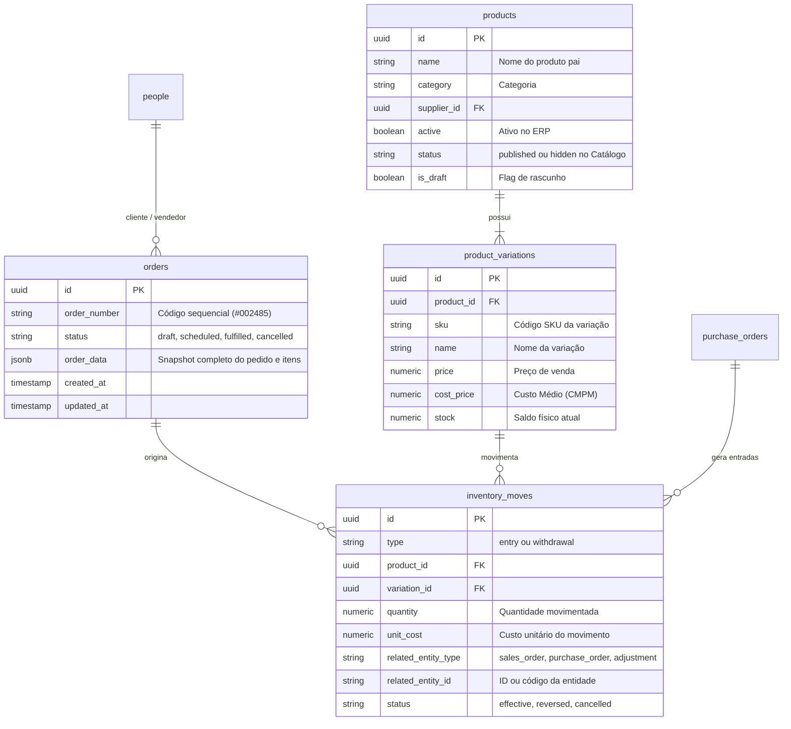

# Estrutura do Banco de Dados e Supabase — Móveis Morante Hub

> **Status:** Ativo / Referência Arquitetural  
> **Banco:** PostgreSQL 15+ hospedado no Supabase  
> **Abordagem:** Modelo Híbrido Relacional + JSONB para flexibilidade operacional e alta performance.

---

## 1. Entidades Principais e Relacionamentos

---

## 2. Decisões Arquiteturais Críticas

### 1. Variações como Itens Físicos (`product_variations`)
- O produto pai (`products`) é apenas um agrupador conceitual (ex: "Sofá Retrátil Madri").
- Todo o controle de estoque, saldo físico (`stock`), custo médio (`costPrice`) e preço de venda (`price`) reside na **variação** (`product_variations`).

### 2. Snapshot de Pedido em `order_data` (JSONB)
- A tabela `orders` armazena colunas indexáveis (`id`, `order_number`, `status`, `created_at`) e um campo JSONB rico chamado `order_data`.
- O `order_data` guarda o snapshot completo no momento da venda (endereço de entrega, itens com suas descrições e observações, dados de pagamento, vendedor selecionado com ID e nome).
- **Vantagem:** Se o preço de um produto mudar no cadastro meses depois, o pedido histórico permanece intacto e auditável.

### 3. Histórico de Movimentações (`inventory_moves`) como Fonte da Verdade
- O saldo do estoque (`stock`) em `product_variations` é um **cache materializado** para leitura rápida.
- A **verdade contábil e de auditoria** é a soma histórica das movimentações válidas em `inventory_moves`.
- Qualquer divergência pode ser recalculada através de replay cronológico dos lançamentos.

---

## 3. Ambientes (Desenvolvimento Local vs Produção)

- **Desenvolvimento Local:**
  - `VITE_SUPABASE_URL` aponta para a instância de desenvolvimento / staging.
  - `VITE_SUPABASE_ANON_KEY` com credenciais de desenvolvimento.
- **Produção (Vercel):**
  - Variáveis configuradas diretamente no painel da Vercel.
  - Políticas de RLS (Row Level Security) ativas para proteção de dados multi-usuário.

---

## 4. Scripts e Migrations
- Migrations organizadas cronologicamente em [`supabase/migrations/`](file:///c:/Users/Rosilene/Desktop/morantehub/supabase/migrations/).
- Configurações da CLI do Supabase em [`supabase/config.toml`](file:///c:/Users/Rosilene/Desktop/morantehub/supabase/config.toml).
