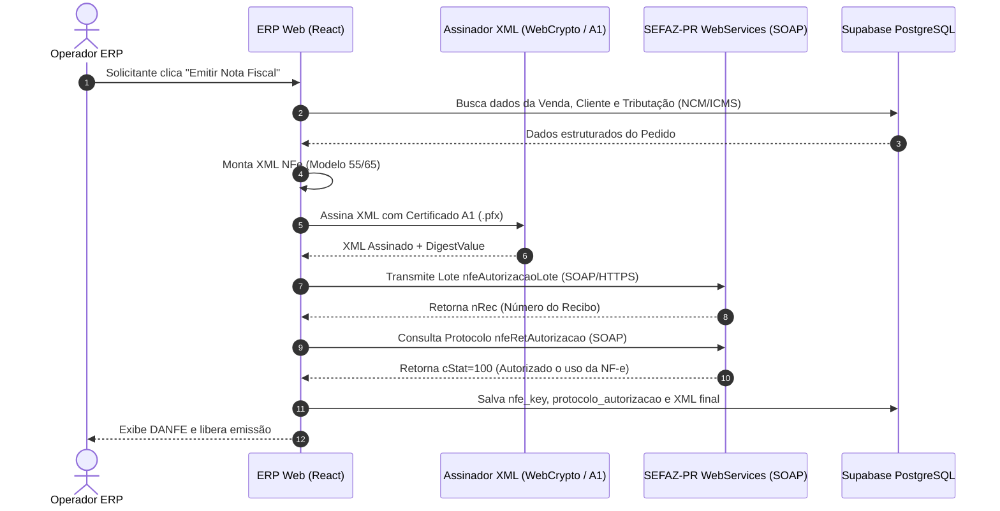
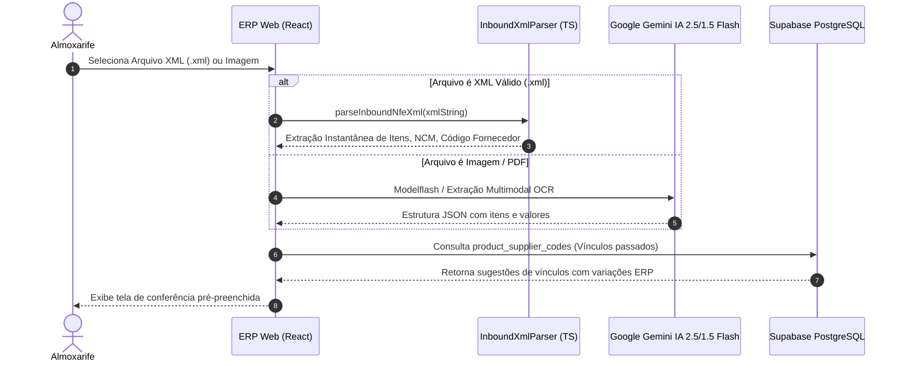
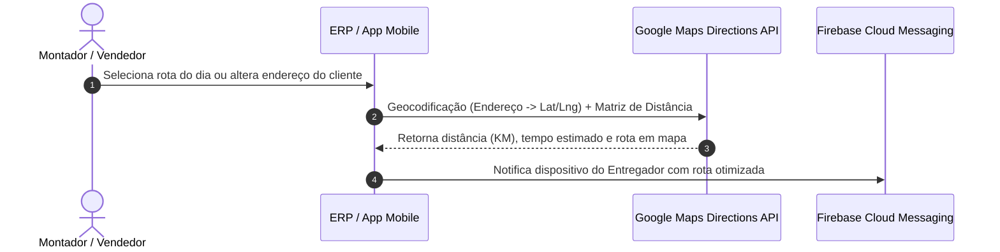

# Integrações Externas — Morante Hub

Este documento descreve a arquitetura e os diagramas de sequência temporal das integrações externas do Morante Hub: SEFAZ-PR (NF-e/NFC-e), Google Maps Platform e IA Google Gemini Native.

---

## 📜 1. Sequence Diagram — Emissão Direta SEFAZ-PR (sem Intermediários)

---

## 🤖 2. Sequence Diagram — Parsing e Classificação NF-e XML / Gemini IA

---

## 🗺️ 3. Sequence Diagram — Geolocalização e Cálculo de Rotas Google Maps

---

## 🔗 Mapeamento em Código e Testes

- **Fiscal SEFAZ**: [`nfeService.ts`](file:///c:/Users/mathe/OneDrive/%C3%81rea%20de%20Trabalho/projetos/morantehub/erp/src/pages/utils/nfe/nfeService.ts) e [`nfe_sefaz_direta.md`](file:///c:/Users/mathe/OneDrive/%C3%81rea%20de%20Trabalho/projetos/morantehub/docs/fiscal/nfe_sefaz_direta.md)
- **IA Gemini Native**: [`geminiAgentService.ts`](file:///c:/Users/mathe/OneDrive/%C3%81rea%20de%20Trabalho/projetos/morantehub/erp/src/services/aiAgent/geminiAgentService.ts)
- **Google Maps**: [`useOrderDistanceCalculator.ts`](file:///c:/Users/mathe/OneDrive/%C3%81rea%20de%20Trabalho/projetos/morantehub/erp/src/pages/App/SalesOrder/hooks/useOrderDistanceCalculator.ts)
