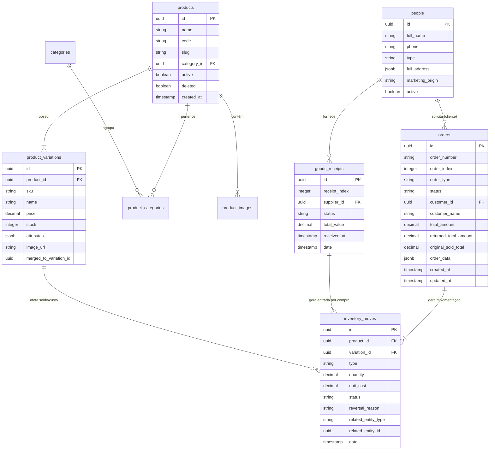

# Modelo de Dados e Schemas PostgreSQL — Morante Hub

Este documento especifica o modelo relacional de dados do Supabase PostgreSQL no Morante Hub, as tabelas principais e seus relacionamentos.

---

## 📐 Diagrama Entidade-Relacionamento (ERD Concept Mermaid)

---

## 🔒 Segurança (RLS - Row Level Security) e Triggers

- Todas as tabelas possuem **Row Level Security (RLS)** configuradas em mode permissivo para operações autorizadas do ERP e App Mobile, evitando rejeições silenciosas.
- A sincronia entre colunas de busca rápida (`customer_name`, `total_amount`, `order_number`) e a coluna JSON `order_data` é mantida por triggers de integridade ou pela helper `buildOrderPersistencePayload()`.
