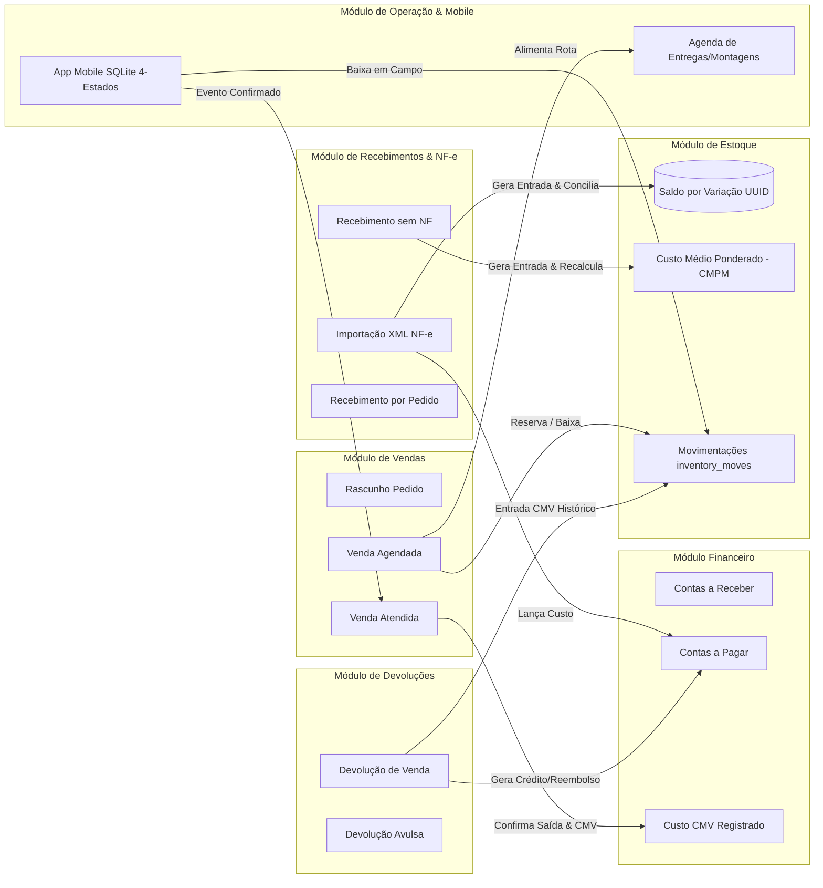
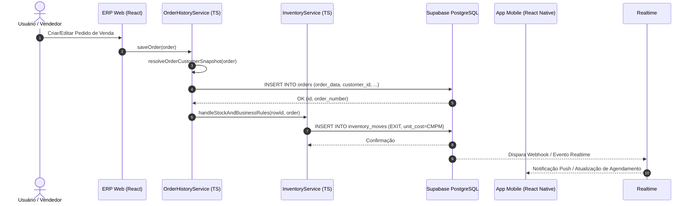

# Módulos e Cooperação entre Sistemas — Morante Hub

Este documento é o guia canônico de como os módulos do ERP Web e do App Mobile se relacionam, cooperam e mantêm dependências funcionais sem acoplamento nocivo.

---

## 🗺️ 1. Grafo de Dependências entre Módulos do Sistema

---

## 📊 2. Matriz de Interação e Efeitos entre Módulos

| Módulo Origem | Módulo Destino | Tipo de Interação | Efeito Provocado |
| :--- | :--- | :--- | :--- |
| **Vendas** | **Estoque** | Escreve / Movimenta | Lança saída de estoque (`inventory_moves`) usando CMPM atual |
| **Vendas** | **Financeiro** | Escreve / Registra | Lança títulos a receber em `orders.payment_methods` e apura margem comercial |
| **Vendas** | **Operação** | Dispara Evento | Inclui agendamento na agenda de entregas e sincroniza App Mobile |
| **Recebimentos** | **Estoque** | Escreve / Recalcula | Incrementa saldo físico e recalcula CMPM da variação |
| **Recebimentos** | **Financeiro** | Escreve | Lança obrigações a pagar ao fornecedor |
| **NF-e Entrada** | **Produtos** | Lê / Vincula | Mapeia `product_supplier_codes` entre fornecedor e variação ERP |
| **Devoluções** | **Estoque** | Escreve / Entra | Lança entrada com o CMV histórico original da venda |
| **Mobile App** | **Servidor/ERP** | Sincroniza (4 Estados) | Envia eventos `PENDING` -> `SYNCING` -> `CONFIRMED`/`REJECTED` |

---

## 🔁 3. Orquestração Temporal de Chamadas

---

## 🔗 4. Mapeamento de Serviços Canônicos no Código

- **Vendas & Ciclo de Vida**: [`orderHistoryService.ts`](file:///c:/Users/mathe/OneDrive/%C3%81rea%20de%20Trabalho/projetos/morantehub/erp/src/pages/utils/orderHistoryService.ts)
- **Estoque, CMPM & Movimentos**: [`inventoryService.ts`](file:///c:/Users/mathe/OneDrive/%C3%81rea%20de%20Trabalho/projetos/morantehub/erp/src/pages/utils/inventoryService.ts)
- **Recebimento de Mercadorias**: [`goodsReceiptService.ts`](file:///c:/Users/mathe/OneDrive/%C3%81rea%20de%20Trabalho/projetos/morantehub/erp/src/pages/utils/goodsReceiptService.ts)
- **NF-e de Entrada & Vínculos**: [`inboundInvoicesService.ts`](file:///c:/Users/mathe/OneDrive/%C3%81rea%20de%20Trabalho/projetos/morantehub/erp/src/pages/utils/inboundNfe/inboundInvoicesService.ts)
- **Produtos & Variações**: [`productMutationService.ts`](file:///c:/Users/mathe/OneDrive/%C3%81rea%20de%20Trabalho/projetos/morantehub/erp/src/pages/utils/productService/productMutationService.ts)
- **Emissão Fiscal SEFAZ-PR**: [`nfeService.ts`](file:///c:/Users/mathe/OneDrive/%C3%81rea%20de%20Trabalho/projetos/morantehub/erp/src/pages/utils/nfe/nfeService.ts)
