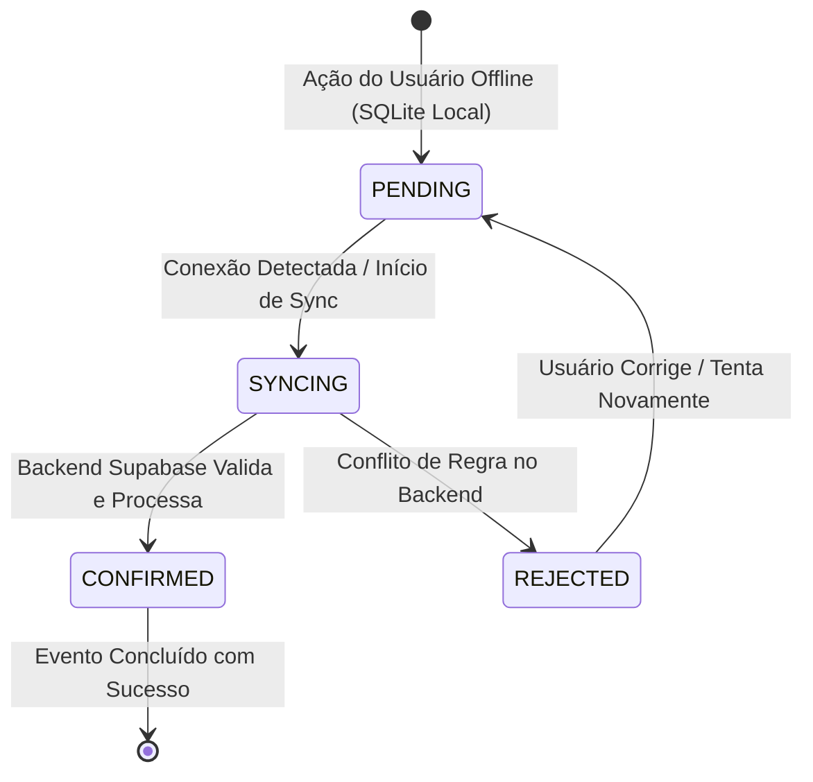

# Arquitetura Offline-First e Sincronização Mobile — Morante Hub

Este documento descreve a arquitetura de resiliência operacional offline do Aplicativo Mobile Morante Hub, baseada em SQLite local, eventos atômicos e idempotência com o Supabase.

---

## 📱 Ciclo de Vida do Evento Offline (4 Estados)

---

## 📋 As 5 Regras Pragmáticas do Offline Mobile

1. **SQLite como Buffer Local Pragmático**: As operações essenciais no campo (vistorias, assinaturas de entrega, conferência física de recebimento, montagens) são salvas imediatamente na base SQLite local do dispositivo.
2. **Ciclo dos 4 Estados do Evento**: Todo evento offline assume estritamente os estados `PENDING` (pendente no celular), `SYNCING` (em transmissão), `CONFIRMED` (processado no banco) ou `REJECTED` (rejeitado por conflito).
3. **Idempotência por Hash/UUID do Evento**: Todo evento de sincronização possui um identificador único (`event_id`). Se a rede oscilar durante o envio, o reenvio é ignorado no servidor sem duplicar lançamentos.
4. **Cache de Leitura Local de Emergência**: Dados essenciais de clientes e entregas do dia são mantidos em cache SQLite para permitir navegação mesmo em áreas cegas de cobertura de internet.
5. **Backend Supabase como Autoridade Estrita**: Se um motorista/montador tentar confirmar uma entrega com dados conflitantes online, a regra do servidor prevalece, e o estado transiciona para `REJECTED` com notificação clara.

---

## 🔗 Mapeamento em Código e Testes

- **Serviço de Sincronização**: `[offlineSyncService.ts](file:///c:/Users/mathe/OneDrive/%C3%81rea%20de%20Trabalho/projetos/morantehub/mobile/src/services/offlineSyncService.ts)`
- **Banco de Dados SQLite**: `[sqlite.ts](file:///c:/Users/mathe/OneDrive/%C3%81rea%20de%20Trabalho/projetos/morantehub/mobile/src/db/sqlite.ts)`
- **Testes de Transação**: `[mobile-transactions.spec.ts](file:///c:/Users/mathe/OneDrive/%C3%81rea%20de%20Trabalho/projetos/morantehub/erp/tests/mobile-transactions.spec.ts)`
- **Documentação de Referência**: `[arquitetura_offline_first.md](file:///c:/Users/mathe/OneDrive/%C3%81rea%20de%20Trabalho/projetos/morantehub/docs/mobile/arquitetura_offline_first.md)`
