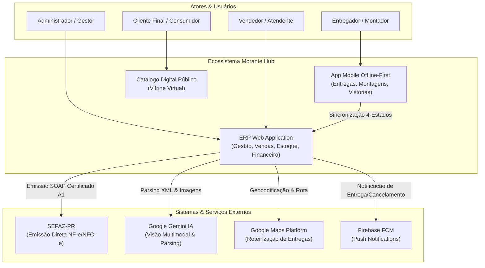
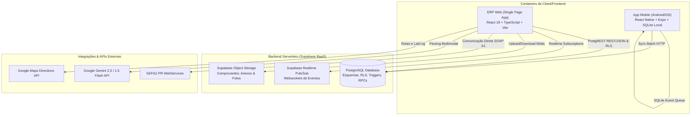

# Visão Geral da Arquitetura Técnica — Morante Hub

Este documento descreve a infraestrutura, a pilha tecnológica e o modelo C4 de arquitetura do ecossistema Morante Hub.

---

## 🏗️ 1. C4 Model — Nível 1: Contexto do Sistema (System Context)

---

## 🏛️ 2. C4 Model — Nível 2: Containers do Sistema

---

## 🔒 3. Princípios Arquiteturais Permanentes

1. **Zero Trust & Sanitização em Borda**: Toda entrada de usuário no ERP ou Mobile é sanitizada e validada via contratos TypeScript estritos.
2. **Prevenção de Egress Excessivo no Supabase**: Consultas utilizam paginação server-side com filtros atômicos (`limit`, `range`), evitando downloads integrais de tabelas.
3. **Limite de R$ 0,00 em Cloud**: A Skill `cloud-free-tier-guard` impõe limites rígidos de consumo em APIs do Google Cloud e Gemini.
