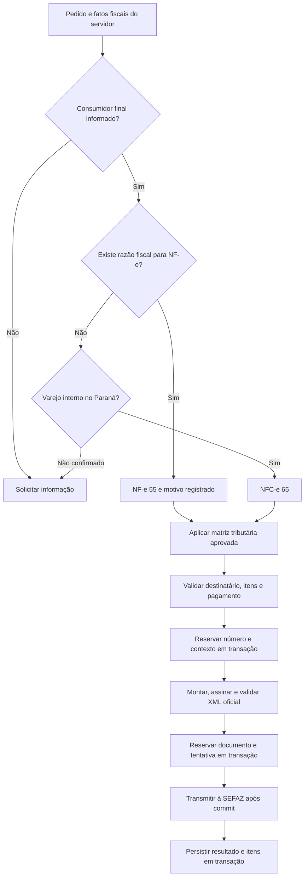

# Modelo fiscal das vendas varejistas no Paraná

Política `PR_RETAIL_2026_10`, revisada em 03/10/2026.

## Orientação ao operador

Na emissão do pedido, preencha **Finalidade da compra**, que define o indicador **Consumidor final**:

- **Uso / consumo próprio** → consumidor final **Sim**, inclusive por pessoa jurídica.
- **Revenda** → consumidor final **Não**.

A prévia mostra o modelo e o motivo. Entrega e retirada são modalidades logísticas; nenhuma escolhe o modelo sozinha. CPF ou CNPJ também não define o modelo sozinho.

| Operação | Modelo |
|---|---|
| Consumidor final, venda interna no PR, retirada | NFC-e 65 |
| Consumidor final, venda interna no PR, entrega em domicílio | NFC-e 65 |
| PJ consumidora final, operação interna compatível | NFC-e 65 |
| Revenda ou adquirente que não é consumidor final | NF-e 55 |
| Operação interestadual ou destinatário em outra UF | NF-e 55 |
| Devolução, transferência, remessa, retorno, exportação ou importação | NF-e 55 |
| Crédito fiscal ou exigência fiscal específica, inclusive Administração Pública | NF-e 55 |
| Valor igual ou superior a R$ 200.000 | NF-e 55 |

NFC-e em entrega usa `indPres=4`, identificação e endereço do destinatário e dados do transportador. O contexto fiscal pode declarar entrega própria para usar os dados reais do emitente, ou conter os dados reais do transportador. Para cartão, use os dados fiscais do pagamento; o comando fiscal também aceita a declaração explícita de terminal separado sem TEF. A interface atual coleta a finalidade da compra e não acrescenta esses dois campos ao modal. Não presumir essas condições nem inventar CPF/CNPJ, endereço, transportador ou autorização de cartão.

O CEP do destinatário é opcional no leiaute; se informado, precisa ter oito dígitos. A dispensa do CEP não dispensa os demais dados de endereço quando obrigatórios. Em NFC-e presencial de valor inferior a R$ 10.000, a identificação pode ser dispensada; a partir desse valor ou em operação não presencial, ela é exigida. NF-e 55 exige identificação e endereço.

## Implementação e auditoria

`shared-utils/fiscalDocumentModel.ts` centraliza a decisão. `resolveOrderFiscalModel` adapta os fatos do pedido e `resolveFiscalDocumentModel` retorna modelo, códigos dos motivos, descrição e versão. O backend determina novamente com pedido, destinatário, itens, valores e emitente consultados no servidor. O browser envia a finalidade da compra como indicador de consumidor final; não tem autoridade para enviar modelo, série, chave ou XML.

Motivos: `RETAIL_FINAL_CONSUMER_IN_STATE`, `INTERSTATE_OPERATION`, `RESALE`, `TAX_CREDIT_REQUIRED`, `RETURN`, `TRANSFER`, `SHIPMENT`, `GOODS_RETURN`, `EXPORT`, `IMPORT`, `PUBLIC_ADMINISTRATION`, `OTHER_FISCAL_REQUIREMENT` e `VALUE_LIMIT`. Novas exigências fiscais devem ser acrescentadas à política central, com fonte e teste focado.

O contexto, o modelo e a justificativa são congelados no snapshot de numeração. A reserva do documento confere chave, ambiente, modelo, consumidor final e trace. Retry consulta/reutiliza o modelo e XML originais; não recalcula a nota usando a logística atual. Proteções contra repetição e concorrência permanecem no banco. Documentos V1 preservam sua identidade.

Essas operações fiscais não movimentam estoque, financeiro ou reservas comerciais. A autorização persiste documento, resposta e itens fiscais na mesma transação. SOAP acontece após o commit; falha ou resposta ambígua fica pendente para reconciliação, sem desfazer fatos comerciais.

### Escopo da emissão existente

`HML_NORMAL_SALE_V2` cobre a matriz já aprovada de venda interna, CRT 1, CFOP 5102 e grupos suportados de ICMS próprio zerado. Escolher 55 por operação interestadual, devolução, crédito ou outra exceção não autoriza reutilizar essa tributação: o fluxo exige a matriz própria da operação. Devoluções/remessas continuam pelos fluxos fiscais específicos. Produção continua exigindo sua aprovação fiscal própria. A alteração do modelo não aprova tributos automaticamente.

O serializer usa NFC-e online com QR Code v3 (`chave|3|tpAmb`), `tpImp=4` e suplemento antes da assinatura. O backend deriva o endpoint HML de autorização/consulta conforme 55 ou 65, sem fallback para Produção. Os builders antigos do frontend permanecem somente como compatibilidade; a emissão usa o Fiscal Core no servidor.

## Fontes oficiais consultadas

- [SEFA/PR — perguntas sobre NFC-e](https://atendimento.fazenda.pr.gov.br/sacsefa/portal/assuntosReferente/22): questões 1463, 1465, 1466 e 1508, venda interna a consumidor final PF/PJ, entrega e identificação.
- [NPF 100/2014 consolidada](https://sped.fazenda.pr.gov.br/sites/sped/arquivos_restritos/files/migrados/File/NFCE/NPF_100_2014_NFCe_Consolidada_com_NPF036_2015.pdf): itens 1.2 e 1.3.
- [Ajuste SINIEF 19/16 vigente](https://www.confaz.fazenda.gov.br/legislacao/ajustes/2016/AJ_019_16): cláusula quarta, identificação/endereço e limite de valor. O Ajuste 9/26 alterou a identificação em operações não presenciais com efeitos em 03/08/2026.
- [Ajuste SINIEF 12/26](https://www.confaz.fazenda.gov.br/legislacao/ajustes/2026/AJ012_26): revogou o Ajuste 11/25; não aplicar a exigência revogada de 55 apenas por CNPJ.
- [MOC 7, Anexo I](https://www.confaz.fazenda.gov.br/legislacao/arquivo-manuais/moc7-anexo-i-leiaute-e-rv.pdf): CEP E13, indicadores de presença e regras X02-10/X03-20 de transporte.
- [Portal NF-e — notas técnicas](https://hom.nfe.fazenda.gov.br/portal/listaConteudo.aspx?AspxAutoDetectCookieSupport=1&tipoConteudo=04BIflQt1aY%3D): NT 2025.001 v1.03, QR Code v3 online.
- [SEFA/PR — web services NFC-e](https://sped.fazenda.pr.gov.br/NFCe/Pagina/Web-Services-NFC-e): endpoints oficiais por ambiente.

Os testes de XML utilizam o pacote oficial fixado `PL_010f_v1.04`; validação XSD não substitui autorização da SEFAZ nem comprova aprovação tributária.

## Banco e testes

Integração usa o Supabase remoto configurado, conforme [política canônica](../testing/SUPABASE_REMOTE_TEST_POLICY.md), sem Docker Desktop. A migration `20261003222817_retail_fiscal_model_policy.sql` amplia as RPCs e guardas HML para o modelo determinado e congela o contexto na mesma transação da numeração. Não altera pedidos, produtos, estoque ou financeiro existentes.

Validação e aplicação remota: [evidências de 03/10/2026](validacao-modelo-varejo-pr-2026-10-03.md).
