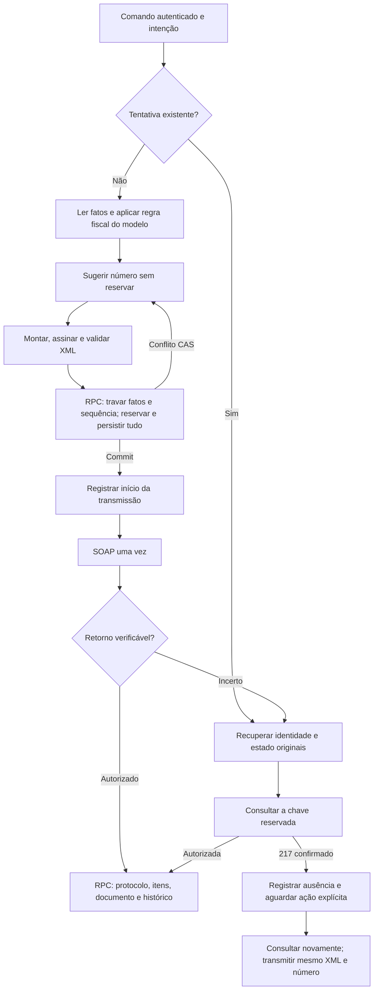

# Reserva, persistência e reconciliação da emissão normal

Atualização: 07/10/2026. Projeto conferido: `hkoxhourxwlddgsfdgws`.

## Fluxo conectado

`api/nfe/emit.ts` encaminha vendas normais de Produção e HML para
`emitNormalSale.ts`. Os dois ambientes reutilizam `normalSaleRuleSet`, Fiscal
Core, serializer, assinatura A1, validação estrutural/XSD, SOAP e parsers.
`consult.ts` e o retry explícito encaminham documentos `NORMAL_SALE_V1` para a
mesma política de tentativa. A fixture técnica e documentos históricos HML
conservam seus adaptadores e funções existentes.

O CAS pode reconstruir até três preparações antes do SOAP. Ele nunca repete uma
transmissão. Um pedido com tentativa ativa continua bloqueado mesmo que outro
comando use um UUID diferente.

## Efeitos e atomicidade

| Transição | Efeitos obrigatórios | Falha e retomada |
|---|---|---|
| Preflight/XML | Nenhum efeito persistente | Falha não reserva nem consome número |
| Preparação | Contador, snapshot/hash, documento/XML assinado, intenção/hash do comando, identidade fiscal, operador e lease | Uma RPC transacional; falha essencial reverte todas as gravações |
| Início do envio | Estado `transmitting`, horário e documento `processando` | Commit antes da chamada externa; perda de confirmação exige consulta |
| Retorno incerto | `reconciling`, motivo e histórico, mantendo XML/chave/número | Sem resend automático; se a gravação falhar, o marcador `transmitting` preserva a incerteza |
| Autorização | Protocolo validado por chave/ambiente/cStat, itens, total, status e histórico | Uma RPC transacional; falha não deixa autorização parcial |
| Consulta 217 | `confirmed_not_found` com chave e ambiente conferidos | Primeira confirmação após incerteza não transmite; outra ação explícita consulta novamente antes de usar o mesmo XML |

Nenhuma dessas transições cria movimentos de estoque, recebíveis, pagamentos ou
mudanças no pedido. Cancelamento, estorno e devolução continuam nas operações
centrais próprias. Um documento final cancelado não é reemitido pela mesma intenção.

A reserva é isolada por **CNPJ completo do estabelecimento, modelo, ambiente e
série canônica** em `nfe_establishment_sequences`. HML/Produção e 55/65 têm
contadores independentes. O estabelecimento existente foi vinculado uma vez ao
contador legado; somente ele espelha esse contador para conviver com os caminhos
históricos. Outro estabelecimento não herda seu número.

Snapshot, XML, chave, UUID da intenção, comando fiscal, hashes e identidade da
tentativa são preservados. A igualdade do comando usa JSON canônico; confirmação
de Produção pode ser renovada, mas destinatário, escolhas fiscais, transporte,
número solicitado e demais escolhas não podem mudar sob a mesma intenção.

Falha comprovada antes da preparação não consome número. Depois do commit, a
reserva permanece registrada, inclusive em falha anterior ao efetivo envio. Não
há decremento, reciclagem automática nem inutilização automática. NFC-e com XML
expirado fica preservada para tratamento próprio, sem troca silenciosa de horário,
chave ou número.

## Migrations aplicadas

| Versão local e remota | Conteúdo |
|---|---|
| `20261007170426_common_outbound_emission` | Ledger por estabelecimento, tentativa comum, preparação atômica, lease, início durável, resultado transacional, imutabilidade |
| `20261007171956_normal_outbound_write_guards` | Conflito CAS de negócio (`23514`), escrita fiscal restrita ao servidor e proteção de itens históricos |

O conflito de número inicialmente usava `40001`. No teste via PostgREST, a
requisição em conflito não devolveu resposta útil dentro do limite. Ao usar
`23514/FISCAL_SEQUENCE_CHANGED`, a disputa devolveu erro de negócio e o próximo
preflight reservou corretamente. O teste passou com duas requisições reais
iniciadas com 3 ms de diferença: números **1/2**, exatamente um conflito CAS,
sem duplicidade. Não se atribui esse comportamento a uma biblioteca específica.

`npm run advisors` foi executado antes das duas migrations. Há alertas anteriores
no projeto. As três tabelas privadas novas aparecem como INFO por terem RLS
habilitado sem política de navegador; isso implementa a recusa de acesso direto.
A execução é exclusiva de `service_role`; não foram criadas políticas permissivas.
Referência: [Supabase — RLS habilitado sem política](https://supabase.com/docs/guides/database/database-linter?lint=0008_rls_enabled_no_policy).

## Evidências da etapa

| Teste | Camada executada | Massa/projeto | Resultado e limite |
|---|---|---|---|
| Emissão nos dois ambientes/modelos, payload diferente, retry, timeout, autorização perdida, cancelado, falha de XML/preparação/resultado | 25 testes Vitest do orquestrador | `TEST_UNIT_*`, SOAP e banco simulados | Fluxo e número de chamadas verificados; não comprova transporte real |
| Comando, API, frontend, core/serializer e compatibilidade HML | 134 testes focados dos consumidores; **159 Vitest no total**, incluindo os 25 do orquestrador | Dados unitários; XSD/assinatura reais nos testes de serializer existentes | Todos passaram após reexecução focada dos arquivos com timeout de importação; sem emissão real ou navegação E2E |
| Isolamento por modelo/ambiente/estabelecimento/série, CAS, rollback após falha essencial, idempotência, protocolo, itens, lease, histórico e permissões | **35 assertivas pgTAP no PostgreSQL remoto** | `TEST_AUT_e54c641b-17b2-4a64-a479-edf7cf49028d`, `hkoxhourxwlddgsfdgws` | Todas passaram; fixtures revertidas, zero pedidos/tentativas/clientes/contadores retidos |
| Duas reservas concorrentes | Duas requisições PostgREST reais | `TEST_AUT_24502b64-0b1c-40e6-b47d-27724b97a844`, mesmo projeto | Números 1 e 2; uma reconstrução CAS; contador sintético removido |

A concorrência foi repetida após o ajuste de limpeza do script, com
`TEST_AUT_4af1fe53-7333-423d-a358-e93ceda8ffc6`: início das requisições com 3 ms
de diferença, números 1/2, exatamente um conflito CAS e zero chamadas SEFAZ.
Três contadores de execuções anteriores que perderam a resposta foram encontrados
na revisão final. Sem documentos, snapshots, tentativas ou vínculo legado, foram
removidos por identidade exata após confirmar ausência de requisições em andamento.
A conferência posterior encontrou **zero contadores de teste retidos**, zero
tentativas comuns e nenhuma requisição de reserva ativa.

As sequências operacionais foram preservadas: Produção 55, última 101/próxima 102;
Produção 65, última **599**/próxima **600**; HML 55, última 112; HML 65, última 629.
Os demais contadores históricos também permaneceram iguais.

TypeScript estrito do grafo fiscal, ESLint dos arquivos ERP alterados e Biome dos
arquivos aplicáveis passaram. `npm run build:fiscal --prefix erp` passou com as
10 rotas, carregamento dos handlers, WASM e schemas oficiais. O script de
concorrência também passou em `node --check`.

O teste de separação HML/Produção no banco usa somente contadores sintéticos de
estabelecimentos fictícios. Nenhum documento de Produção é criado. A persistência
de documentos/retornos no pgTAP usa HML, XML sintético e protocolo simulado dentro
de uma transação revertida. Isso testa a fronteira SQL; não equivale a uma
assinatura válida ou autorização SEFAZ.

Reexecução: `supabase/tests/commonOutboundEmission.sql` exige UUID novo no
placeholder; `node scripts/testing/common-outbound-concurrency.cjs` usa Vercel
Development, confere o project ref, gera seu próprio contador HML e limpa somente
essa fixture quando ambas as requisições têm conclusão confirmada. Em resposta
perdida, registra `cleanup-pending` com a identidade sintética para consulta e
limpeza controlada; abortar HTTP não comprova que a operação no banco terminou.
Ambos não possuem caminho de emissão para a SEFAZ.

## Limites atuais

- A venda normal usa a decisão compartilhada `fiscal_decision_simples_normal_sale_v1`
  com escopo explícito para os modelos 55/65. O registro legado do modelo 55 é
  mantido para compatibilidade com históricos, sem fallback para novas emissões.
  Veja [a decisão e seus limites](decisoes-contribuicoes-venda-normal.md).
- A regra de venda normal cobre o escopo já implementado. Operações que exigem
  outra matriz tributária continuam bloqueadas antes da reserva.
- Correção/substituição de XML rejeitado, tratamento de NFC-e expirada,
  inutilização e contingência seguem políticas próprias; não são ações automáticas
  deste pipeline. Documentos legados conservam seus caminhos históricos.
- Nenhuma emissão fiscal real foi realizada. Testes SOAP usam mocks. A etapa não
  comprova emissão real, certificação integral de todos os leiautes/notas técnicas
  nem instalação da cadeia completa de migrations em banco vazio.
- A publicação da revisão final e uma eventual validação na interface são etapas
  distintas. Este registro não exige novo checklist ou evidência fiscal documental.
