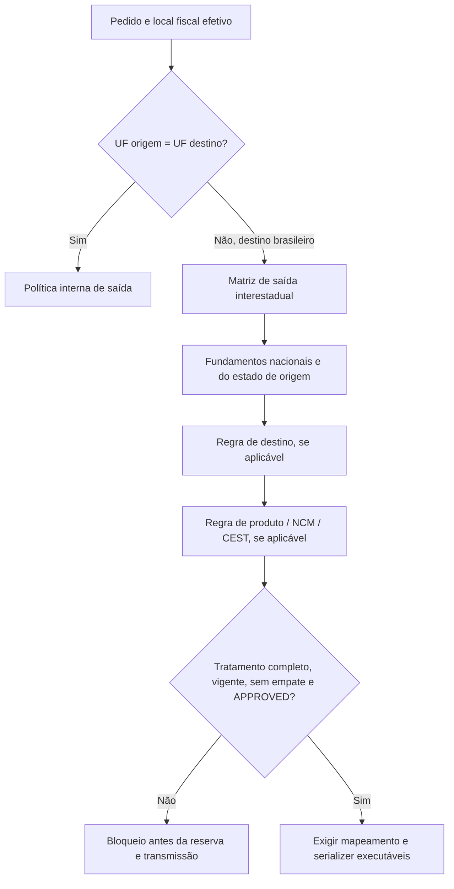

# Matriz de Decisão Fiscal Interestadual de Saída

Nome no código: **Interstate Outbound Fiscal Matrix**, módulo `api/nfe/interstateOutboundFiscalMatrix.ts`. Revisão de escopo e reconciliação do catálogo: **07/10/2026**. A auditoria fiscal anterior foi preservada e classificada por abrangência; a mudança de nome não aprova tratamento tributário.

## Escopo geográfico e autoridade fiscal

Uma saída é interestadual quando a UF fiscal de destino é brasileira e diferente da UF do emitente. No contexto atual, a base tem emitente PR, ambiente 2, NF-e 55, CRT 1, venda normal (`finNFe=1`) e mercadoria de terceiros. O destino da base é wildcard, representado por `destinationUf: null`, com `destinationScope: 'INTERSTATE'`.

| Rota física | Classificação | Política selecionada |
| --- | --- | --- |
| PR → PR | INTERNAL | Política interna existente `HML_NORMAL_SALE_V2` |
| PR → SC | INTERSTATE | Mesma matriz-base de saída interestadual |
| PR → SP | INTERSTATE | Mesma matriz-base de saída interestadual |
| PR → RS | INTERSTATE | Mesma matriz-base de saída interestadual |
| PR → outra UF brasileira | INTERSTATE | Mesma matriz-base; enquadramento tributário ainda obrigatório |
| PR → EX | FOREIGN | Fora desta matriz; exige política de exterior |

Entrega usa o endereço efetivo determinado pela política central; retirada usa o estabelecimento emitente ou o endereço efetivo de retirada informado. A UF cadastral do cliente, isoladamente, não define a rota. Ausência/invalidade de UF bloqueia. O resolver rejeita mesma UF e exterior mesmo se receber um wildcard ou uma fixture APPROVED.

**Inventário documental: 20 DRAFT, 4 BLOCKED, 0 APPROVED.** As 24 combinações são células de revisão, não tratamentos executáveis. A reconciliação de 07/10/2026 confirmou cinco famílias gerais DRAFT e uma família geral BLOCKED no runtime: **5 DRAFT, 1 BLOCKED e 0 APPROVED**. Cada família geral agrupa quatro células do inventário (PF/PJ × ST indicada/não indicada). Não há tratamento tributário executável específico de SC. A auditoria do cenário PR→SC está preservada como histórico em [auditoria-interestadual-pr-sc.md](auditoria-interestadual-pr-sc.md); ela não cria comportamento especial no runtime e suas fontes não fundamentam automaticamente SP, RS ou outra UF.

## Camadas e escopos normativos

As regras têm `normativeScope`; cada fundamento em `normativeSources` tem seu próprio escopo e os vínculos necessários. `sourceReferences` mantém os links para diagnóstico. Aprovação exige correspondência entre ambas as representações.

| Escopo | Conteúdo reaproveitado | Limite imposto ao uso |
| --- | --- | --- |
| NATIONAL | MOC/NTs, CFOP, LC 123, LC 190, Convênios 142/18 e 236/21 | Não resolve sozinho benefícios, ST, DIFAL ou fundos de um produto/destino |
| ORIGIN_STATE | Decreto PR 5.144/2024, legislação/orientações PR | A fonte deve vincular PR ao critério de origem da regra |
| DESTINATION_STATE | RICMS/SC, orientação DIFAL, Fundo Social e consultas delimitadas de SC | Requer destino SC explícito; não pode sustentar wildcard |
| ORIGIN_DESTINATION_PAIR | Exame de acordo/protocolo para uma rota | Exige origem e destino explícitos; protocolos históricos descartados não aprovam uma rota |
| PRODUCT_SPECIFIC | Enquadramento por produto, descrição, NCM/CEST, origem e papel ST | Exige critério correspondente de produto/NCM/CEST; nenhum produto operacional foi aprovado |

Uma fonte de SC anexada a uma regra geral APPROVED torna essa aprovação inválida, até que a regra tenha o destino explícito e os demais requisitos completos. A mesma restrição vale para uma fonte de par origem/destino ou de produto usada sem seus critérios.

## Fundamentos nacionais e do Paraná

Fontes consultadas na auditoria de 06/10/2026, agora reclassificadas sem ampliar suas conclusões:

| ID | Escopo | Fonte oficial | Conclusão delimitada |
| --- | --- | --- | --- |
| N1 | NATIONAL | [MOC 7.0, Anexo I, revisão 7.03](https://www.confaz.fazenda.gov.br/legislacao/arquivo-manuais/moc7-anexo-i-leiaute-e-rv.pdf) | E16a-40/696; indicadores de IE; grupos N10c–N10g e NA01-20 |
| N2 | NATIONAL | [Tabela CFOP do CONFAZ](https://www.confaz.fazenda.gov.br/legislacao/ajustes/sinief/cfop_cvsn_1-6.24) | Classificação de 6102/6108/6403/6404; CFOP não determina o imposto |
| N3 | NATIONAL | [LC 123/2006, compilada](https://www.planalto.gov.br/ccivil_03/leis/lcp/lcp123.htm) | Arts. 13, 18 e 23; Simples, recolhimentos fora do DAS e condições do crédito |
| N4 | NATIONAL | [Convênio ICMS 142/18](https://www.confaz.fazenda.gov.br/legislacao/convenios/2018/CV142_18) | Cláusulas 2–4, 7–9 e 20; acordo, destino, descrição/NCM/CEST e responsabilidade |
| N5 | NATIONAL | [LC 190/2022](https://www.planalto.gov.br/ccivil_03/leis/lcp/lcp190.htm) e [Convênio 236/21](https://www.confaz.fazenda.gov.br/legislacao/convenios/2021/CV236_21) | Regime nacional de DIFAL; não comprova, isoladamente, tratamento específico CRT 1 |
| PR1 | ORIGIN_STATE | [Decreto PR 5.144/2024](https://www.sefanet.pr.gov.br/dados/SEFADOCUMENTOS/102202405144.pdf) | Alteração 928, tabela CSOSN; cada código exige seus pressupostos |
| PR2 | ORIGIN_STATE | [SEFA/PR — ICMS-ST](https://www.fazenda.pr.gov.br/Pagina/ICMS-Substituicao-tributaria) | Remissão ao Anexo IX e obrigações do substituto; não fixa acordo/MVA por produto |
| PR3 | ORIGIN_STATE | [Lei PR 11.580/1996, compilada](https://www.legislacao.pr.gov.br/legislacao/pesquisarAto.do?action=exibir&codAto=278020&codTipoAto=1&tipoVisualizacao=compilado) | Operação/local e responsabilidade; não usar redação revogada como autorização |

### Notas técnicas e limites da pesquisa preservada

Na pesquisa anterior, o Portal Nacional apresentou loop de redirecionamento. Os PDFs foram consultados no [portal oficial SVRS](https://dfe-portal.svrs.rs.gov.br/Nfe/Documentos), em memória, sem arquivar manuais:

- [NT 2025.002 v1.52](https://dfe-portal.svrs.rs.gov.br/NFE/DownloadArquivoEstatico/?sistema=NFE&tipoArquivo=3&nomeArquivo=NT_2025.002_v1.52_RTC_NF-e_IBS_CBS_IS.pdf): cronograma, pp. 4–7, e NA01-20, pp. 37–38. A exceção técnica de ICMSUFDest para Simples não prova `difalApplicable=false`. O cronograma CRT 1 não foi equiparado ao CRT 3.
- [NT 2026.002 v1.11](https://dfe-portal.svrs.rs.gov.br/NFE/DownloadArquivoEstatico/?sistema=NFE&tipoArquivo=3&nomeArquivo=NT_2026.002_v1.11_DANFE_Simpl_Tp2_Emi_Offline_Autoriz_Alerta.pdf): DANFE Simplificado Tipo 2; esta matriz não habilita `tpImp=6` ou emissão offline.
- [NT 2026.007 v1.10](https://dfe-portal.svrs.rs.gov.br/NFE/DownloadArquivoEstatico/?sistema=NFE&tipoArquivo=3&nomeArquivo=NT2026.007_v1.10%20-%20Emiss%C3%A3o%20NF-e%20sem%20IE%20e%20RV%20LCC.pdf): pp. 3–5 e 10, cadastro/CRT, cronograma HML até 05/10/2026 e produção 03/11/2026. Contribuinte exclusivo IBS/CBS não substitui o enquadramento ICMS CRT 1 deste fluxo.

Essa verificação foi das seções pertinentes, não da conformidade integral do emissor com todas as NTs/RTC. O XSD local `PL_010f_v1.04` não foi atualizado por esta refatoração. Passar no XSD não aprova incidência tributária.

## Dimensões, candidatos e decisões pendentes

São independentes: modelo, finalidade, origem/destino fiscal, PF/PJ, indIEDest, indFinal, mercadoria própria/terceiros, produto, NCM, CEST, origem fiscal, ST e vigência. CFOP, CSOSN, ICMS, DIFAL, FCP e FCP-ST são decisões do tratamento; não se inferem uns dos outros. O CSOSN indicado para esta matriz é um candidato comum do emitente/operação, não uma regra selecionada pela UF de destino. A preferência atual registrada é `103` para todas as UFs; sua comprovação legal continua pendente e, por isso, não libera as famílias `DRAFT`.

O filtro de CFOP continua classificando `internal`/`interstate`/`foreign` antes de natureza da operação, tipo de mercadoria, destinatário e ST. 6102 e 6108 são candidatos condicionais. Não se escolhe 6102 apenas porque o estado mudou. 6933 não é candidato para venda de mercadoria. CEST não prova ST.

| Referência do inventário | Ramo fiscal a comprovar | Pendência que impede executar |
| --- | --- | --- |
| C | CSOSN 103/ICMSSN102 como candidato comum; outros códigos somente com fundamento próprio | Comprovar a isenção por faixa de receita no PR e sua aplicação; sem seleção por UF de destino |
| F | ICMSSN102 para 102/103/300/400 conforme enquadramento comprovado | Ausência de crédito não comprova tributação comum ou elimina benefícios |
| S | Substituto 201/202/203 ou substituído 500, segundo operação real | Produto, descrição, retenção anterior, papel, acordo vigente, bases, alíquotas e serializer |
| D0 | Examinar finalidade de revenda e eventual antecipação do adquirente | Regime do adquirente e legislação do destino; conclusões de SC não se generalizam |
| D1 | Examinar uso/consumo/ativo por contribuinte e possível ST-DIFAL | Incidência, responsável, benefício, destino, produto e cálculo |
| D9 | Examinar consumidor final não contribuinte e situação do remetente Simples | Conclusão jurídica por enquadramento/destino; exceção XML não significa não incidência |
| X | FCP e FCP-ST | Incidência/base/alíquota/recolhimento por destino/produto; permanece unresolved |

Nenhuma família geral tem tratamento `APPROVED` executável nem vigência aprovada. Os cinco registros DRAFT carregam candidatos para análise — inclusive CSOSN 103, CFOP 6102/6108 e zeros de ST/DIFAL/FCP —, mas o status e as pendências impedem que esses valores sejam usados para autorizar ou montar XML. NCM precisa ter 8 dígitos; CEST, quando presente, 7; origem fiscal, 0–8 comprovada. CEST vazio exige análise de enquadramento, não só um cadastro vazio. O NCM 94035000 das fixtures é sintético e não aprova mercadoria operacional.

## Inventário completo e mudança dos IDs

Os 24 IDs abaixo são identificadores documentais das células de revisão; o catálogo executável usa IDs agregados diferentes, mapeados na auditoria a seguir. Nenhuma migration ou reescrita de histórico fiscal foi executada.

`I` é contribuinte isento de IE; `NC` é não contribuinte. A combinação NC/não final está BLOCKED por N1 E16a-40/696, para esta venda normal de saída. DRAFT também impede emissão; suas dependências de destino continuam obrigatórias.

| ID (prefixo INTERSTATE-) | Pessoa | IE | Final | ST alegada | Tratamento | Status | Motivo específico |
| --- | --- | --- | --- | --- | --- | --- | --- |
| PJ-TAXPAYER-NONFINAL-NO-ST | PJ | 1 | 0 | não | C/D0/X | DRAFT | Crédito/regime/benefício/produto |
| PJ-TAXPAYER-NONFINAL-ST | PJ | 1 | 0 | sim | S/D0/X | DRAFT | Papel/acordo/base ST |
| PJ-TAXPAYER-FINAL-NO-ST | PJ | 1 | 1 | não | F/D1/X | DRAFT | DIFAL uso/ativo/produto |
| PJ-TAXPAYER-FINAL-ST | PJ | 1 | 1 | sim | S/D1/X | DRAFT | Responsabilidade ST-DIFAL |
| PJ-EXEMPT-FINAL-NO-ST | PJ | 2 | 1 | não | F/D1/X | DRAFT | Prova da condição isenta |
| PJ-EXEMPT-FINAL-ST | PJ | 2 | 1 | sim | S/D1/X | DRAFT | Isenção de IE e papel ST |
| PJ-NONTAXPAYER-FINAL-NO-ST | PJ | 9 | 1 | não | F/D9/X | DRAFT | Simples/destino/produto |
| PJ-NONTAXPAYER-FINAL-ST | PJ | 9 | 1 | sim | S/F/D9/X | DRAFT | Retenção anterior/saída atual |
| PF-NONTAXPAYER-FINAL-NO-ST | PF | 9 | 1 | não | F/D9/X | DRAFT | Simples/destino/produto |
| PF-NONTAXPAYER-FINAL-ST | PF | 9 | 1 | sim | S/F/D9/X | DRAFT | Retenção anterior/saída atual |
| PJ-EXEMPT-NONFINAL-NO-ST | PJ | 2 | 0 | não | C/D0/X | DRAFT | Isento não implica final; prova do crédito |
| PJ-EXEMPT-NONFINAL-ST | PJ | 2 | 0 | sim | S/D0/X | DRAFT | Isento não implica final; papel ST |
| PJ-NONTAXPAYER-NONFINAL-NO-ST | PJ | 9 | 0 | não | Não executável | BLOCKED | E16a-40/696 |
| PJ-NONTAXPAYER-NONFINAL-ST | PJ | 9 | 0 | sim | Não executável | BLOCKED | E16a-40/696 |
| PF-TAXPAYER-NONFINAL-NO-ST | PF | 1 | 0 | não | C/D0/X | DRAFT | PF contribuinte: crédito/enquadramento |
| PF-TAXPAYER-NONFINAL-ST | PF | 1 | 0 | sim | S/D0/X | DRAFT | PF contribuinte: papel/acordo |
| PF-TAXPAYER-FINAL-NO-ST | PF | 1 | 1 | não | F/D1/X | DRAFT | PF contribuinte: uso/ativo |
| PF-TAXPAYER-FINAL-ST | PF | 1 | 1 | sim | S/D1/X | DRAFT | PF contribuinte: ST-DIFAL |
| PF-EXEMPT-NONFINAL-NO-ST | PF | 2 | 0 | não | C/D0/X | DRAFT | Condição isenta/regime/crédito |
| PF-EXEMPT-NONFINAL-ST | PF | 2 | 0 | sim | S/D0/X | DRAFT | Condição isenta/papel ST |
| PF-EXEMPT-FINAL-NO-ST | PF | 2 | 1 | não | F/D1/X | DRAFT | Condição isenta/uso/ativo |
| PF-EXEMPT-FINAL-ST | PF | 2 | 1 | sim | S/D1/X | DRAFT | Condição isenta/ST-DIFAL |
| PF-NONTAXPAYER-NONFINAL-NO-ST | PF | 9 | 0 | não | Não executável | BLOCKED | E16a-40/696 |
| PF-NONTAXPAYER-NONFINAL-ST | PF | 9 | 0 | sim | Não executável | BLOCKED | E16a-40/696 |

## Reconciliação das regras agregadas no runtime

Foram auditadas individualmente as cinco regras que estavam `APPROVED` em `rules.ts`. Não foi localizado registro independente que sustentasse a atribuição `approvedBy: FISCAL_COUNCIL`; essa atribuição, as datas de aprovação e as evidências de teste/XML que aparentavam validar o tratamento completo foram removidas. As cinco regras agora são `DRAFT`, sem vigência aprovada. Os campos de tratamento que ainda constam nelas são valores candidatos de rascunho e não podem alimentar uma emissão.

| ID agregado no runtime | Células documentais cobertas (4 combinações: PF/PJ × ST sim/não) | O que as fontes sustentam | Lacuna que impede aprovação | Estado reconciliado |
| --- | --- | --- | --- | --- |
| `INTERSTATE-TAXPAYER-NONFINAL-BASE` | `PJ-TAXPAYER-NONFINAL-*`, `PF-TAXPAYER-NONFINAL-*` | N2 classifica 6102 para mercadoria de terceiros; N1/N3–N5 e PR1–PR3 dão regras técnicas e contextuais | CFOP não prova a validade do candidato CSOSN 103, crédito, ICMS, ausência de ST/DIFAL/FCP, nem validade para todo destino/NCM | DRAFT |
| `INTERSTATE-TAXPAYER-FINAL-BASE` | `PJ-TAXPAYER-FINAL-*`, `PF-TAXPAYER-FINAL-*` | N2 classifica 6102; N1 define indicadores do XML | `indFinal=1` não informa se é uso/consumo ou ativo; destino, DIFAL, ST/FCP, crédito e produto precisam de decisão concreta | DRAFT |
| `INTERSTATE-EXEMPT-NONFINAL-BASE` | `PJ-EXEMPT-NONFINAL-*`, `PF-EXEMPT-NONFINAL-*` | N1 RV 805/E16a-30 cobre a validação técnica do indIEDest por UF; N2 classifica 6102 | Aceitação técnica de IE isenta não aprova CSOSN/ICMS nem ausência de ST/DIFAL/FCP para todos os produtos/destinos | DRAFT |
| `INTERSTATE-EXEMPT-FINAL-BASE` | `PJ-EXEMPT-FINAL-*`, `PF-EXEMPT-FINAL-*` | N1 RV 805/E16a-30 cobre validação técnica por UF; N2 classifica 6102 | A validação técnica não determina finalidade material, DIFAL, ST/FCP, crédito ou tratamento do produto | DRAFT |
| `INTERSTATE-NONTAXPAYER-FINAL-BASE` | `PJ-NONTAXPAYER-FINAL-*`, `PF-NONTAXPAYER-FINAL-*` | N2 classifica 6108 para venda a não contribuinte; N1 cobre validações do XML | LC 190 estabelece responsabilidades de DIFAL para consumidor final; exceção de leiaute para CRT 1 não comprova incidência zero, nem encerra ST/FCP e regras de destino/produto | DRAFT |
| `INTERSTATE-NONTAXPAYER-NONFINAL-BASE` | `PJ-NONTAXPAYER-NONFINAL-*`, `PF-NONTAXPAYER-NONFINAL-*` | N1 E16a-40 prevê rejeição 696 para saída a não contribuinte sem `indFinal=1` | A combinação permanece tecnicamente bloqueada pela rejeição nacional | BLOCKED |

O início da auditoria de conteúdo para `INTERSTATE-TAXPAYER-FINAL-BASE`, usando o pedido HML #4268 como caso de referência, está em [auditoria da família contribuinte-consumidor final](auditoria-familia-interestadual-contribuinte-final.md). Essa análise não aprova a família nem estende seus achados de SC a outras UFs.

As cinco famílias DRAFT têm `environment=2`, modelo 55, emitente PR/CRT 1 e mercadoria de terceiros. Seus curingas alcançavam qualquer UF brasileira, PF/PJ, NCM, CEST, origem de produto e estado de ST dentro desse escopo; não havia critério nem evidência para generalizar as conclusões tributárias a todas essas combinações. CFOP 6102/6108 é mantido como candidato classificatório, não como decisão tributária. A tabela oficial do CONFAZ delimita esses CFOPs; o Convênio 142/18 vincula ST à mercadoria, descrição, NCM/CEST, legislação e condições do acordo; LC 123 e LC 190 não validam sozinhas os tratamentos zero codificados. Fontes: [tabela CFOP do CONFAZ](https://www.confaz.fazenda.gov.br/legislacao/ajustes/sinief/cfop_cvsn_1-6.24), [Convênio ICMS 142/18](https://www.confaz.fazenda.gov.br/legislacao/convenios/2018/CV142_18), [LC 123/2006](https://www.planalto.gov.br/ccivil_03/leis/lcp/lcp123.htm), [LC 190/2022](https://www.planalto.gov.br/ccivil_03/leis/lcp/lcp190.htm) e [MOC 7.0, Anexo I](https://www.confaz.fazenda.gov.br/legislacao/arquivo-manuais/moc7-anexo-i-leiaute-e-rv.pdf).

## Regras específicas por destino e auditorias

**Tratamentos tributários executáveis específicos por destino: nenhum.** [A auditoria PR→SC](auditoria-interestadual-pr-sc.md) está preservada como registro histórico, sem efeito sobre a resolução atual. Uma regra futura de destino exige diferença concreta, `destinationUf` explícito e fontes classificadas; protocolos exigem o par origem/destino e o produto pertinente.

As fixtures APPROVED de testes são sintéticas e demonstram apenas a precedência de critérios: uma fixture com destino SC pode vencer a geral quando for mais específica. Isso não representa um override operacional de SC nem um cadastro fiscal aprovado.

## Hierarquia, vigência e bloqueio

Hierarquia lexicográfica: **produto > NCM > CEST > UF destino específica > ST > indIEDest > PF/PJ > indFinal > origem fiscal > própria/terceiros > prioridade**. Destino null e omitido têm a mesma especificidade. A ordem do array não decide. Empate bloqueia. Não se mesclam partes de tratamentos de regras distintas; escolhe-se uma regra completa.

Regras futuras/expiradas saem antes da comparação. `effectiveFrom`/`effectiveUntil` correspondem a validFrom/validUntil, com limites inclusivos e intervalo consistente. Wildcards de aprovação exigem revisão explícita de cada dimensão; wildcard geográfico não dispensa conhecer a UF concreta no request. A resolução utilizável retorna `ruleId`, motivo, links e fontes classificadas.

Continuam obrigatórios: fatos completos, critérios/escopos coerentes, tratamento integral, vigência, aprovação identificada, fontes suficientes e evidências XML/testes. Sem regra utilizável, permanece `HML_INTERSTATE_MATRIX_NOT_APPROVED`. A aprovação declarativa também não substitui o mapeamento executável do ruleset e do serializer.

## Invalidação e efeitos

O modal já invalida resultados ao mudar modelo/finalidade/UF/endereços/CPF-CNPJ/IE/indIEDest/indFinal/NCM/CEST/origem/mercadoria/ST/quantidade ou características fiscais. O servidor recalcula a partir dos fatos atuais; classificação geográfica não deriva de CFOP.

Esta refatoração não cria/reverte estoque, financeiro, reservas comerciais ou fatos confirmados. A falta de regra bloqueia antes da RPC de snapshot numerado, assinatura e SOAP. Nenhuma transmissão ou reconciliação real foi iniciada. Os fatos fiscais existentes e sua idempotência permanecem preservados.

## XML, testes e validação

**Nenhuma regra interestadual geral está APPROVED.** A reconciliação reclassificou as cinco famílias antes marcadas como aprovadas para DRAFT; não havia registro rastreável de aprovação fiscal nem evidência XML para o tratamento completo fora dos próprios campos dessas regras. Testes sintéticos continuam cobrindo contexto → regra sintética → resolução → XML, sem emissão real. Grupos tributários não implementados e campos não serializados são rejeitados, inclusive valores zero; não houve generalização de impostos de SC.

| Validação focada | Resultado |
| --- | --- |
| `fiscalCfopMatrix.test.ts` | 50 testes aprovados |
| `hmlTechnicalEmission.test.ts` | 45 testes aprovados |
| `fiscalCoreSerializer.test.ts` | 9 testes aprovados |
| **Total** | **104 testes aprovados** |

A rodada dos três módulos passou com 103 casos. Após acrescentar a prova positiva de fontes de origem/par e substituir o acesso de propriedade pela forma recomendada pelo lint, o módulo completo da matriz foi repetido: 50/50 aprovados. Os outros módulos não mudaram depois de aprovados. Os testes usam mocks/fixtures locais; não há emissão via CLI, acesso real ao banco ou SOAP real.

Cobertura nova: PR→PR interno; PR→SC/SP/RS na mesma base; todos os outros 26 destinos brasileiros em fixture sintética; entrega personalizada e retirada efetiva; rejeição de exterior/UF inválida/mesma UF; precedência sintética de regra com destino explícito sobre regra geral; prioridade produto/NCM sobre destino; empate de destino null/omitido; finalidade/escopo obrigatórios; fontes NATIONAL/ORIGIN_STATE/DESTINATION_STATE/ORIGIN_DESTINATION_PAIR/PRODUCT_SPECIFIC e rejeição de uso fora de seus critérios. PR→SC/SP/RS sem resolução APPROVED bloqueia antes da RPC numerada e do SOAP.

TypeScript da matriz e API fiscal passou; a API foi verificada com `--ignoreDeprecations 6.0 --rootDir . --module ESNext --moduleResolution Bundler` para acomodar o TypeScript instalado e os imports compartilhados, sem modificar configuração. ESLint dos testes ERP e Biome dos módulos API passaram. `git diff --check` passou. Não foi executada compilação integral do ERP nesta refatoração de domínio.

Reauditoria do escopo e reconciliação: cinco regras gerais foram reclassificadas como DRAFT após verificar individualmente o alcance de seus curingas, a cobertura das fontes e a falta de registro rastreável de aprovação; o ramo não contribuinte/não final permanece BLOCKED pela RV E16a-40/696. As 20 células DRAFT e quatro BLOCKED correspondem às seis famílias gerais do runtime (5 DRAFT e 1 BLOCKED). Os gates PR→SC usados durante a revisão foram removidos em 07/10/2026 por redundância: as famílias gerais agora bloqueiam SC pelo mesmo status aplicado às demais UFs. O catálogo tem 5 DRAFT, 1 BLOCKED e 0 APPROVED, sem tratamento fiscal específico de SC. Catálogo, validação de escopo/fontes e seleção permanecem responsabilidades server-side; não houve emissão real nem deploy. A transmissão interestadual permanece bloqueada até que cada família receba decisão fiscal rastreável e cobertura completa.

A próxima aprovação exige fatos e tratamento concretos, inclusive as normas do destino pertinentes, e implementação/testes do XML correspondente. Generalizar o escopo geográfico não transforma pendências em decisões tributárias.
