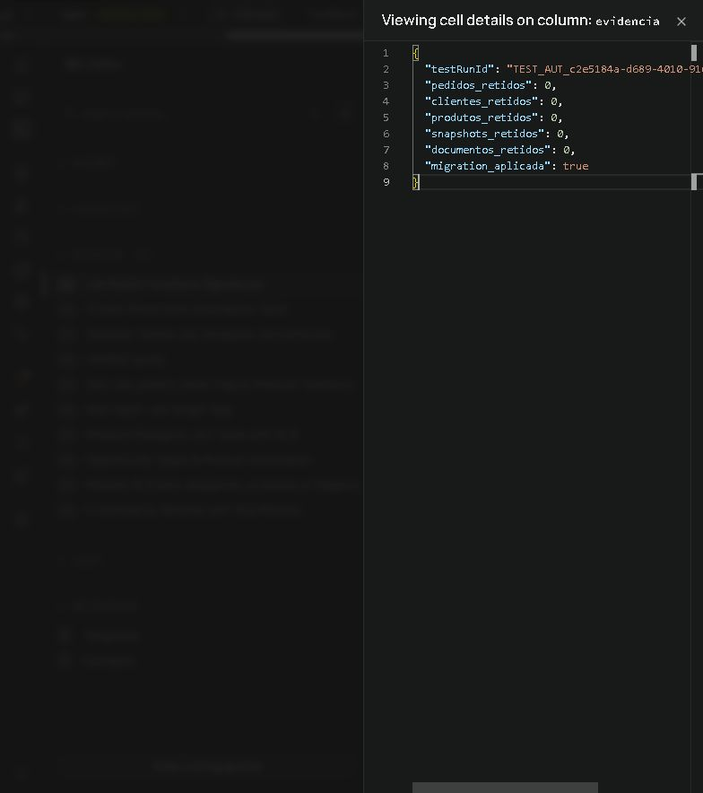

# Validação da política fiscal de varejo — 03/10/2026

> **Evidência histórica:** os gates e a aplicação remota registrados abaixo pertencem à execução de 03/10/2026. O estado do banco e do deploy não foi reconsultado nesta auditoria documental. Consulte o [status de testes atual](status-testes-homologacao.md) e a [política de teste remoto](../testing/SUPABASE_REMOTE_TEST_POLICY.md) antes de planejar qualquer repetição.

Política: `PR_RETAIL_2026_10`. Checkpoint: `TEST_AUT_c2e5184a-d689-4010-916a-46a4eb6561bc`.

## Gates executados

| Gate | Estado | Evidência |
|---|---|---|
| Projeto remoto | APROVADO | `hkoxhourxwlddgsfdgws`, correspondente ao Development configurado; SQL Editor autenticado. Nenhuma credencial registrada. |
| Advisors antes da migration | APROVADO para este lote | CLI falhou com `DbConfigLoginRoleNetworkError`; Dashboard consultado. Cinco alertas existentes de RLS/view fora do escopo, sem ampliá-los. Novas RPCs têm execução apenas por `service_role`. |
| Migration | APROVADO | `20261003222817_retail_fiscal_model_policy.sql` aplicada em transação e registrada no histórico remoto. Esquema PostgREST recarregado. |
| Decisão, API, modal, XML e compatibilidade | APROVADO | 144 testes focados únicos nos arquivos listados abaixo. Sem suíte completa. |
| TypeScript da API fiscal | APROVADO | `npx tsc --project api/tsconfig.nfe.json --pretty false`. |
| Lint das fontes ERP alteradas | APROVADO | ESLint dos arquivos fiscais e de documentação afetados, sem erros. |
| Build fiscal | APROVADO | Bundle, execução dos handlers, carregamento WASM e resolução do XSD oficial. |
| RPCs PostgreSQL | APROVADO | Script `scripts/testing/nfe-retail-remote-controlled.sql` executado no remoto; resultados e fixtures integralmente revertidos. |

Testes focados: `fiscalModelPolicy` (19), `hmlTechnicalEmission` (30), `nfeServiceServerBoundary` (8), `fiscalCoreSerializer` (5), `hmlNormalSaleRuleSet` (16), `useNfeEmission` (16), `fiscalModalIntegrity` (18), `fiscalCoreBoundary` (8), `fiscalDocumentRule` (3), `nfeModules` (6), `sefazHmlTrust` (9) e `danfeGeneratorModules` (6).

## Integração remota e isolamento

Uma fixture de cliente, uma de produto e três de pedido, todos sintéticos e próprios da execução. Pedidos com UUID e marcador HML explícito; cliente/produto identificados pelo `TEST_AUT_` acima. Série temporária escolhida dentre 880–889 somente quando ausente das sequências HML; toda reserva revertida. A primeira tentativa com série 990 foi recusada pela regra existente antes da reserva do snapshot; a fixture foi corrigida para a faixa permitida.

IDs dos pedidos próprios:

- `64097924-8f87-4446-8241-5f7ae4df454e`
- `c7522feb-0a5a-4be0-b5f0-ba3435f446f3`
- `4faf5563-d1c6-4267-b591-0d61cb8ffa25`

Propriedades exercitadas no PostgreSQL:

- Reserva e congelamento do contexto para 55/65; repetição mantém snapshot, hash e número.
- Mudança de contexto com a mesma intenção é recusada sem consumir número.
- Divergência de consumidor final no XML é recusada; o modelo persistido corresponde ao snapshot.
- Segunda tentativa ativa com outro modelo para o mesmo pedido é recusada.
- Outro token não toma a tentativa ativa, não a libera e não persiste seu resultado.
- Falha no segundo item fiscal reverte a autorização inteira, incluindo o primeiro item.
- Resultado e itens fiscais são gravados juntos; repetição não duplica itens.
- Modelo e estado autorizado são imutáveis.
- Falha na captura do destinatário após alocação reverte snapshot e número.
- Numeração manual mantém contexto e número selecionado.
- RPC de contexto HML recusa ambiente 1.
- Permissões de `anon`/`authenticated` não foram ampliadas.

Não houve SOAP. XML mínimo e protocolo de fixture foram usados somente para exercitar as RPCs dentro da transação revertida; não são documentos assinados ou autorizações SEFAZ. Os testes separados do serializer validaram XML assinado com certificado sintético no XSD oficial.

Durante a transação, a massa não criou movimento de estoque, contas a receber, transação financeira ou pagamento de pedido. Checksum dos indicadores e contagem da fila de atualização permaneceram iguais. A consulta após `ROLLBACK` confirmou **zero** pedidos, clientes, produtos, snapshots e documentos retidos desta execução. Nenhum pedido/cliente/produto operacional foi atualizado.

## Limites da evidência

- Não houve autorização real de NFC-e 65 pela SEFAZ nem teste de Produção nesta mudança.
- Não houve teste simultâneo entre conexões; controle de token e rejeição de repetição foram exercitados sequencialmente. Não atribuir a eles prova de concorrência real.
- A migration foi aplicada no banco remoto existente; instalação em banco vazio não foi validada.
- O TypeScript completo do ERP apresentou erros preexistentes em vários módulos, incluindo os tipos ERP de `node:tls/getCACertificates`. A configuração TypeScript própria da API fiscal passou. A verificação completa do ERP não está aprovada.
- A matriz tributária da emissão normal continua limitada ao escopo aprovado de venda interna CRT 1/CFOP 5102. Operações especiais exigem seus fluxos/matrizes próprios; selecionar 55 não libera uma tributação genérica.
- A interface atual usa “Finalidade da compra” para definir consumidor final. Transporte/cartão exigem fatos reais no contexto fiscal; a correção não inventa essas informações.
