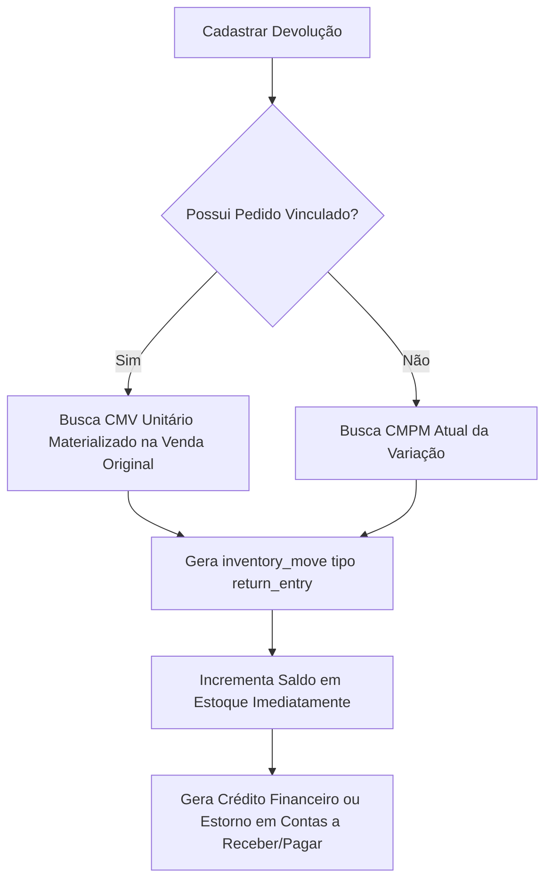

# Devoluções Vinculadas e Livres — Morante Hub

Este documento define as regras operacionais, movimentação de estoque, reuso de CMV e regras financeiras aplicadas a devoluções de mercadorias no Morante Hub.

---

## 🔄 Tipos de Devolução

### 1. Devolução Vinculada a Pedido Original (`orderType: 'return'`, `linkedOrderId` presente)
- Ocorre quando o cliente devolve itens de uma venda previamente cadastrada no ERP.
- **Regra de CMV/Custo**: A entrada de estoque utiliza **exatamente o mesmo CMV unitário materializado na saída da venda original**. Isso garante perfeita neutralização contábil da margem de lucro.
- **Entrada Imediata de Estoque**: A devolução cadastrada (seja agendada ou atendida) gera **entrada imediata no estoque no momento do cadastro**.
- **Ocultação de Montagens**: Em devoluções (`is_return: true`), os selos de montagem (`Drill`) **não são exibidos**, pois devoluções não geram nova ordem de montagem.

### 2. Devolução Livre / Não Vinculada (`UnlinkedReturnOrderModal`)
- Ocorre quando um cliente devolve um produto sem a localização prévia do pedido original no sistema.
- **Regra de Custo**: Utiliza o **CMPM vigente** da variação no momento da devolução.

---

## 🔁 Fluxo de Entrada de Estoque em Devolução

---

## 🔗 Mapeamento em Código e Testes

- **Regras de Estoque e Custo**: `[returnInventoryRules.ts](file:///c:/Users/mathe/OneDrive/%C3%81rea%20de%20Trabalho/projetos/morantehub/erp/src/pages/utils/returnInventoryRules.ts)`
- **Processamento de Entradas**: `[returnInventoryService.ts](file:///c:/Users/mathe/OneDrive/%C3%81rea%20de%20Trabalho/projetos/morantehub/erp/src/pages/utils/returnInventoryService.ts)` → `processReturnInventoryEntries()`
- **Modais**: `[ReturnOrderModal.tsx](file:///c:/Users/mathe/OneDrive/%C3%81rea%20de%20Trabalho/projetos/morantehub/erp/src/pages/App/SalesOrder/OrderActions/ReturnOrderModal.tsx)` e `[UnlinkedReturnOrderModal.tsx](file:///c:/Users/mathe/OneDrive/%C3%81rea%20de%20Trabalho/projetos/morantehub/erp/src/pages/App/SalesOrder/UnlinkedReturnOrderModal.tsx)`
- **Testes de Proteção**: `[latestRulesBattery.test.ts](file:///c:/Users/mathe/OneDrive/%C3%81rea%20de%20Trabalho/projetos/morantehub/erp/src/pages/utils/latestRulesBattery.test.ts)`
