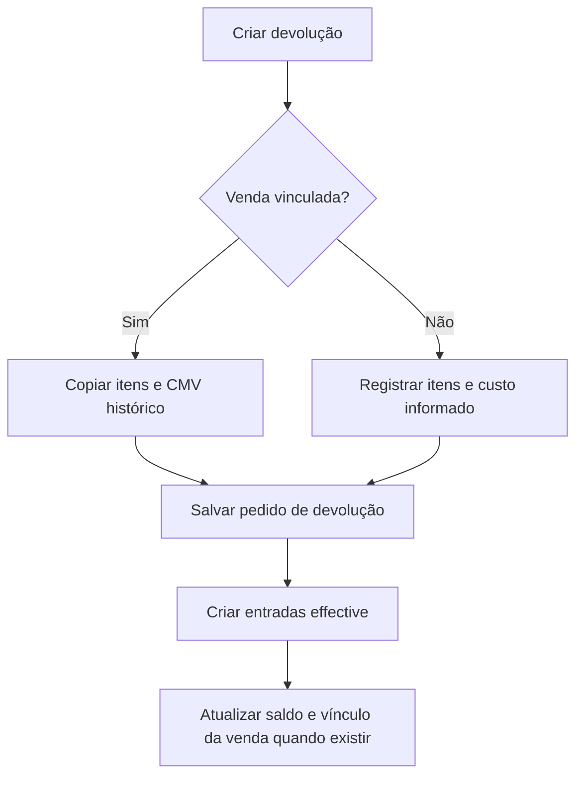

# Devoluções Vinculadas e Livres — Morante Hub

Uma devolução é um novo pedido com `orderType: return`; ela não altera nem apaga a venda que a originou. O pedido guarda o vínculo (`linkedOrderId`), o tipo (`complete` ou `partial`) e dois snapshots financeiros: `originalSoldTotal` e `returnedTotalAmount`.

## Criação e efeito de estoque

| Origem | Estado inicial | Custo de entrada | Estoque |
| --- | --- | --- | --- |
| Devolução vinculada com coleta | `scheduled` | CMV materializado da venda | entrada imediata |
| Devolução vinculada entregue na loja | `fulfilled` | CMV materializado da venda | entrada imediata |
| Devolução sem venda vinculada | `scheduled` | custo registrado no item devolvido | entrada quando houver item de catálogo |

A entrada é uma `inventory_move` `entry`, vinculada ao pedido de devolução e criada para item de catálogo não temporário. Sua data é a data de cadastro da devolução. A devolução vinculada preserva o valor originalmente vendido e permite que o valor efetivamente devolvido seja diferente.

## Implementação

- [Criação vinculada](../../../erp/src/pages/App/SalesOrder/OrderActions/ReturnOrderModal.tsx)
- [Criação sem vínculo](../../../erp/src/pages/App/SalesOrder/UnlinkedReturnOrderModal.tsx)
- [Entrada de estoque](../../../erp/src/pages/utils/returnInventoryService.ts)
- [Regras de entrada](../../../erp/src/pages/utils/returnInventoryRules.ts)
