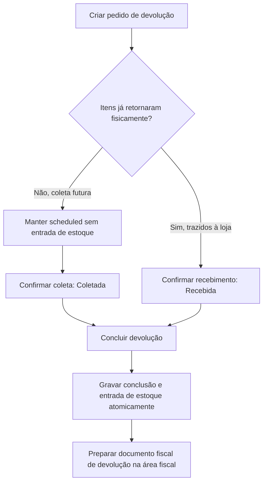

# Devoluções Vinculadas e Livres — Morante Hub

Uma devolução é um novo pedido com `orderType: return`; ela não apaga a venda que a originou. A devolução vinculada guarda `linkedOrderId`, o tipo (`complete` ou `partial`) e os snapshots financeiros `originalSoldTotal` e `returnedTotalAmount`.

## Cadastro, retorno físico e estoque

Criar o pedido de devolução registra a solicitação e o vínculo comercial. A entrada de estoque só pode ocorrer quando os itens retornarem fisicamente:

| Situação física | Estado da devolução | Efeito de estoque esperado |
| --- | --- | --- |
| Coleta ainda será feita no endereço | `scheduled` | Nenhuma entrada ao cadastrar; confirmar como **Coletada** antes de concluir e receber estoque. |
| Cliente já trouxe os itens à loja | `fulfilled` (**Recebida**) | Registrar a entrada junto à confirmação física. |
| Devolução sem venda vinculada, aguardando recebimento | `scheduled` | Nenhuma entrada ao cadastrar; receber fisicamente e concluir antes de lançar estoque. |

Quando confirmada, cada entrada é uma `inventory_move` do tipo `entry`, vinculada ao pedido de devolução, para item de catálogo elegível. A devolução vinculada preserva o CMV da venda; a devolução livre usa o custo registrado no item. O registro fiscal de devolução é preparado depois do retorno físico, sem substituir nem cancelar a NF-e original.

```mermaid
flowchart TD
  A[Criar pedido de devolução] --> B{Itens já retornaram fisicamente?}
  B -->|Não, coleta futura| C[Manter scheduled sem entrada de estoque]
  C --> D[Confirmar coleta: Coletada]
  B -->|Sim, trazidos à loja| E[Confirmar recebimento: Recebida]
  D --> F[Concluir devolução]
  E --> F
  F --> G[Gravar conclusão e entrada de estoque atomicamente]
  G --> H[Preparar documento fiscal de devolução na área fiscal]
```

## Estado verificável da implementação

- [ReturnOrderModal.tsx](../../../erp/src/pages/App/SalesOrder/OrderActions/ReturnOrderModal.tsx) cria a coleta futura como `scheduled`; quando o cliente já entregou os itens na loja, cria a devolução como `fulfilled` e mantém `returnStockProcessed: false`.
- [useOrderHistory.ts](../../../erp/src/pages/App/SalesOrder/OrderHistoryList/useOrderHistory.ts) pede confirmação antes de passar uma devolução agendada para `fulfilled`.
- O fluxo de atualização usa [orderUpdateService.ts](../../../erp/src/pages/utils/orderMutation/orderUpdateService.ts); a criação vinculada usa [orderCreationService.ts](../../../erp/src/pages/utils/orderMutation/orderCreationService.ts), que chama `create_return_order_with_capacity` ou `create_return_order_with_fiscal_capacity`.
- Em 09/10/2026, uma consulta somente de leitura ao projeto Supabase configurado confirmou as definições remotas dessas duas RPCs e de `create_order_with_inventory_transaction`. A RPC principal trata devolução `fulfilled` como entrada, grava pedido, movimento de estoque, saldo e histórico na mesma transação PostgreSQL e usa lock de transação/idempotência. A RPC de capacidade valida o saldo da venda, chama essa transação e atualiza o vínculo comercial; a versão fiscal também grava as alocações fiscais na mesma chamada.
- A atomicidade do caminho normal está confirmada pela definição atualmente instalada no banco, mas as migrations que criaram essas RPCs base não estão neste checkout. O teste [orderInventoryAtomic.cjs](../../../supabase/tests/orderInventoryAtomic.cjs) aponta para uma migration de origem que também não foi encontrada. O helper [returnInventoryService.ts](../../../erp/src/pages/utils/returnInventoryService.ts) não é chamado pelo caminho normal de atualização; o lançamento normal é feito pela RPC.

Essa leitura confirma a implementação remota, mas não prova o rollback em falha, retries ou concorrência, e não recupera a origem versionada das RPCs. Esses pontos continuam pendentes de fonte SQL local e validação automatizada; veja o [status fiscal e de fluxos relacionados](../../fiscal/status-testes-homologacao.md). Nesta verificação das RPCs não houve escrita no banco nem execução de testes.

## Referências

- [Criação de devolução vinculada](../../../erp/src/pages/App/SalesOrder/OrderActions/ReturnOrderModal.tsx)
- [Confirmação de coleta/recebimento](../../../erp/src/pages/App/SalesOrder/OrderHistoryList/ReturnFulfillmentConfirmModal.tsx)
- [Entrada de estoque](../../../erp/src/pages/utils/returnInventoryService.ts) e [regras da entrada](../../../erp/src/pages/utils/returnInventoryRules.ts)
- [Regras fiscais da NF-e de devolução](../../fiscal/nfe-devolucao.md)
- [Desfazer uma devolução](estorno-devolucao.md)
