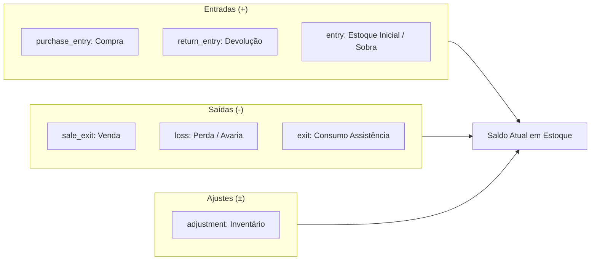

# Movimentações de Estoque e Cálculo de CMPM — Morante Hub

Este documento detalha o funcionamento do livro razão de estoque (`inventory_moves`), tipos de movimentação, cálculo do Custo Médio Ponderado Móvel (CMPM) e prevenção de corrida de concorrência.

---

## 📈 Fórmula Canônica do Custo Médio Ponderado Móvel (CMPM)

Toda entrada por compra ou recebimento físico de fornecedor recalcula o CMPM da variação do produto utilizando a seguinte fórmula:

$$\text{Novo CMPM} = \frac{(\text{Estoque Atual} \times \text{CMPM Atual}) + (\text{Qtd Recebida} \times \text{Custo Unitário Entrado})}{\text{Estoque Atual} + \text{Qtd Recebida}}$$

### Invariantes do Cálculo:
1. **Saídas NÃO alteram o CMPM**: Saídas por venda, transferência ou perda apenas consomem o saldo em estoque multiplicando pelo CMPM vigente, sem alterar o valor unitário.
2. **Entradas Sem Custo (`unitCost = 0`)**: Entradas sem custo informado mantêm o CMPM atual inalterado para evitar diluição artificial de ativos.

---

## 🔁 Tipos de Movimentação de Estoque (`inventory_moves`)

| Tipo (`type`) | Efeito no Saldo | Recalcula CMPM? | Descrição |
| :--- | :--- | :--- | :--- |
| `purchase_entry` | **+ Entra** | **Sim** | Recebimento físico de mercadoria comprada de fornecedor. |
| `return_entry` | **+ Entra** | **Não** (reutiliza CMV) | Devolução de produto por cliente. |
| `entry` | **+ Entra** | Se informado custo | Lançamento de estoque inicial ou sobra de inventário. |
| `sale_exit` | **- Sai** | **Não** | Saída decorrente de venda de pedido de cliente. |
| `loss` | **- Sai** | **Não** | Baixa por quebra, avaria ou sinistro no depósito. |
| `exit` | **- Sai** | **Não** | Consumo interno de peças em assistência técnica. |
| `adjustment` | **± Ajusta** | **Não** | Acerto de saldo resultante de contagem física de inventário. |

---

## 🔒 Concorrência e Bloqueios em Estoque

- O serviço `[inventoryService.ts](file:///c:/Users/mathe/OneDrive/%C3%81rea%20de%20Trabalho/projetos/morantehub/erp/src/pages/utils/inventoryService.ts)` processa movimentações garantindo unicidade de ID e ordenação por data.
- Consultas de saldo consolidado executam agregações server-side com cache inteligente via local storage (`productLocalCache.ts`).

---

## 🔗 Mapeamento em Código e Testes

- **Serviço de Estoque**: `[inventoryService.ts](file:///c:/Users/mathe/OneDrive/%C3%81rea%20de%20Trabalho/projetos/morantehub/erp/src/pages/utils/inventoryService.ts)`
- **Regras de Custo**: `[movingAverageCostRules.ts](file:///c:/Users/mathe/OneDrive/%C3%81rea%20de%20Trabalho/projetos/morantehub/erp/src/pages/utils/movingAverageCostRules.ts)`
- **Testes de Proteção**: `[goodsReceiptCostCalculation.test.ts](file:///c:/Users/mathe/OneDrive/%C3%81rea%20de%20Trabalho/projetos/morantehub/erp/src/pages/utils/goodsReceiptCostCalculation.test.ts)`
