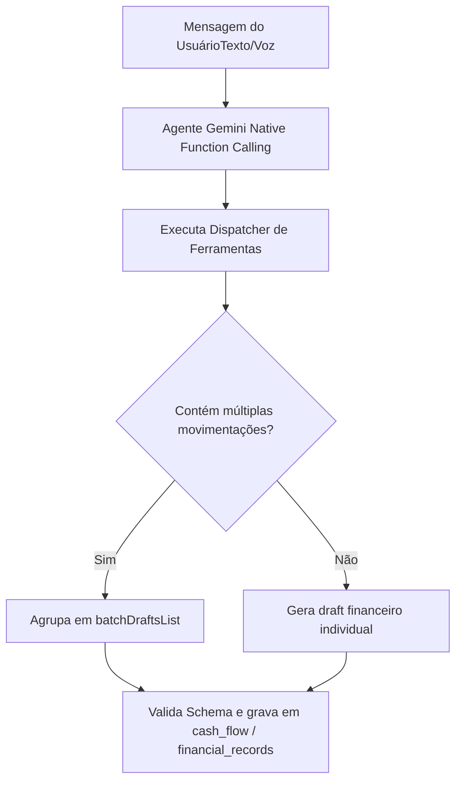

# Financeiro e Assistente Conversacional IA Gemini — Morante Hub

Este documento descreve as regras do módulo financeiro, gestão de caixa, contas a pagar/receber e o funcionamento do Assistente Conversacional IA Gemini.

---

## 🤖 Regras Invioláveis do Assistente Financeiro IA

1. **Exclusividade de Fatos Ocorridos**: O Assistente Financeiro de IA registra **exclusivamente fatos financeiros já ocorridos**. É proibido gerar parcelamentos futuros ou recorrências automáticas por suposição.
2. **Processamento Estritamente Batch-Aware (`batchDraftsList`)**: Se o usuário enviar uma mensagem por texto ou voz contendo múltiplas movimentações (ex: *"Recebi 500 reais da venda 10 e paguei 120 de combustível"*), o assistente monta um lote em `batchDraftsList` e confirma todas simultaneamente.
3. **Classificação Automática de Despesas Operacionais (`BUSINESS`)**: Salários, combustível, manutenção veicular, impostos, fornecedores e empréstimos da empresa são identificados automaticamente com finalidade `BUSINESS`, sem questionar se são despesas pessoais.

---

## 📊 Estrutura de Movimentações Financeiras

---

## 🔗 Mapeamento em Código e Testes

- **Agente IA Gemini**: `[geminiAgentService.ts](file:///c:/Users/mathe/OneDrive/%C3%81rea%20de%20Trabalho/projetos/morantehub/erp/src/services/aiAgent/geminiAgentService.ts)`
- **Dispatcher de Tools**: `[geminiToolDispatcher.ts](file:///c:/Users/mathe/OneDrive/%C3%81rea%20de%20Trabalho/projetos/morantehub/erp/src/services/aiAgent/geminiToolDispatcher.ts)`
- **Serviço de Caixa**: `[cashFlowService.ts](file:///c:/Users/mathe/OneDrive/%C3%81rea%20de%20Trabalho/projetos/morantehub/erp/src/pages/utils/cashFlowService.ts)`
- **Testes de Proteção**: `[financialInvariants.test.ts](file:///c:/Users/mathe/OneDrive/%C3%81rea%20de%20Trabalho/projetos/morantehub/erp/src/pages/utils/financialInvariants.test.ts)` e `[financialAiAssistantRules.test.ts](file:///c:/Users/mathe/OneDrive/%C3%81rea%20de%20Trabalho/projetos/morantehub/erp/src/pages/utils/financialAiAssistantRules.test.ts)`
