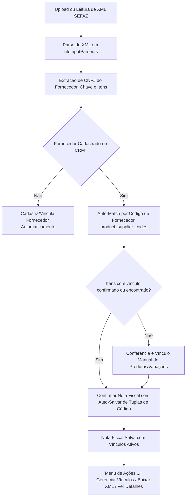

# Importação e Conferência de NF-e de Entrada XML — Morante Hub

Este documento especifica a mecânica de leitura de arquivos XML de Notas Fiscais Eletrônicas de compra emitidas por fornecedores, conciliação de produtos e conversão em recebimentos de compras.

---

---

## 📄 Fluxo de Processamento e Regras da NF-e de Entrada

---

## 📋 Diretrizes e Comportamento da Interface

1. **Paginação Server-Side**: Exibição de **30 notas por página** com busca server-side e contagem exata no Supabase.
2. **Filtros de Período**: Suporte a limites UTC completos (Ano Atual, Ano Passado, Mês Atual, Mês Anterior, Mês Específico e Intervalo Personalizado).
3. **Trava de Fornecedor**: O dropdown de fornecedor é bloqueado (`disabled`) no modal de importação se existirem itens com produtos vinculados na nota (`"🔒 Para alterar o fornecedor da NF, desvincule primeiro todos os produtos da nota."`).
4. **Confirmação e Fechamento**: Botão **"Confirmar Nota Fiscal"** fecha o modal e recarrega a tabela limpa (sem popup de detalhes automático).
5. **Menu de 3 Pontos (`...`) e Ações**:
   - Cada linha/card possui menu dropdown com **"Gerenciar Vínculos"** e **"Baixar XML"**.
   - Clique no corpo do card/linha abre o modal de detalhes da NF-e.
   - Gerenciamento de vínculos via `ManageInboundInvoiceMappingsModal.tsx` com o botão **"Salvar Alterações"**.
6. **Validação de Duplicidade de Chave de Acesso**:
   - Ao importar via XML, PDF, Imagem ou digitar a chave de acesso (no módulo de Notas Fiscais de Entrada ou Recebimentos), a função `checkInboundInvoiceKeyExists` valida se a chave já existe no Supabase ou local storage.
   - Caso a chave já exista, a ação é bloqueada e o modal de alerta `InboundDuplicateKeyAlertModal.tsx` é aberto na tela, exigindo o clique em "Entendi e Fechar" para destravar a tela.

---

## 🔗 Mapeamento em Código e Serviços

- **Serviço de Notas de Entrada**: `[inboundInvoicesService.ts](file:///c:/Users/mathe/OneDrive/%C3%81rea%20de%20Trabalho/projetos/morantehub/erp/src/pages/utils/inboundNfe/inboundInvoicesService.ts)`
- **Modal de Importação**: `[InboundDocumentImportModal.tsx](file:///c:/Users/mathe/OneDrive/%C3%81rea%20de%20Trabalho/projetos/morantehub/erp/src/pages/App/Stock/InboundInvoices/InboundDocumentImportModal.tsx)`
- **Modal de Alerta de Chave Duplicada**: `[InboundDuplicateKeyAlertModal.tsx](file:///c:/Users/mathe/OneDrive/%C3%81rea%20de%20Trabalho/projetos/morantehub/erp/src/pages/App/Stock/InboundInvoices/InboundDuplicateKeyAlertModal.tsx)`
- **Modal de Gerenciamento de Vínculos**: `[ManageInboundInvoiceMappingsModal.tsx](file:///c:/Users/mathe/OneDrive/%C3%81rea%20de%20Trabalho/projetos/morantehub/erp/src/pages/App/Stock/InboundInvoices/ManageInboundInvoiceMappingsModal.tsx)`
- **Serviço de Códigos de Fornecedor**: `[productSupplierCodesService.ts](file:///c:/Users/mathe/OneDrive/%C3%81rea%20de%20Trabalho/projetos/morantehub/erp/src/pages/utils/productSupplierCodesService.ts)`
- **Parser XML**: `[inboundXmlParser.ts](file:///c:/Users/mathe/OneDrive/%C3%81rea%20de%20Trabalho/projetos/morantehub/erp/src/pages/utils/inboundNfe/inboundXmlParser.ts)`
