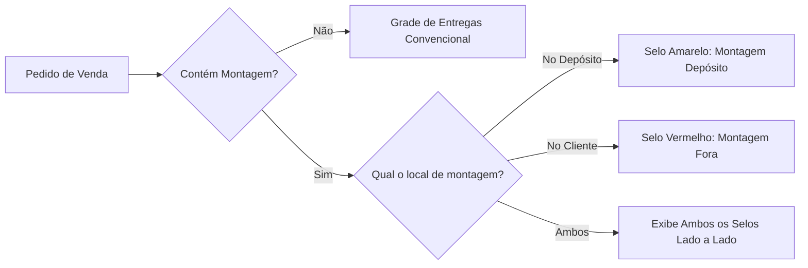

# Operação Logística, Montagens e Entregas — Morante Hub

Este documento descreve as regras do módulo de logística, agendamento de entregas, selos operacionais de montagem (`Drill`) e cálculo de rotas com Google Maps.

---

## 🚛 Agendamento de Entregas e Montagens

1. **Atribuição Automática à Grade Operacional**:
   - Todo pedido de venda com `orderType: 'sale'` e status `scheduled` ou `fulfilled` que exija entrega ou montagem é integrado à grade de entregas (`DeliverySchedule`).
2. **Selos Oficiais de Montagem (`Drill` - Furadeira Preenchida)**:
   - **Montagem Depósito** (`bg-amber-500`): Móvel montado no depósito antes da entrega.
   - **Montagem Fora** (`bg-red-600`): Móvel montado na casa/local do cliente.
   - Se um pedido contiver ambos os tipos, ambos os selos são exibidos lado a lado.
   - Em devoluções (`is_return: true`), selos de montagem **NÃO** são exibidos.

---

## 🗺️ Rotas e Geolocalização

- **API Oficial Google Maps**: Cálculo exclusivo de distâncias e rotas via API oficial do Google Maps Platform, com fallback geográfico padrão para o Paraná (`PR`).

---

## 🔗 Mapeamento em Código e Testes

- **Ícone Oficial Drill ERP**: `[DrillIcon.tsx](file:///c:/Users/mathe/OneDrive/%C3%81rea%20de%20Trabalho/projetos/morantehub/erp/src/components/shared/DrillIcon.tsx)`
- **Ícone Oficial Drill Mobile**: `[MobileDrill.tsx](file:///c:/Users/mathe/OneDrive/%C3%81rea%20de%20Trabalho/projetos/morantehub/mobile/src/components/shared/MobileDrill.tsx)`
- **Calculadora de Distância**: `[useOrderDistanceCalculator.ts](file:///c:/Users/mathe/OneDrive/%C3%81rea%20de%20Trabalho/projetos/morantehub/erp/src/pages/App/SalesOrder/hooks/useOrderDistanceCalculator.ts)`
- **Testes de Proteção**: `[googleMapsNavigationDeliveryFlow.test.ts](file:///c:/Users/mathe/OneDrive/%C3%81rea%20de%20Trabalho/projetos/morantehub/erp/src/pages/utils/googleMapsNavigationDeliveryFlow.test.ts)`
