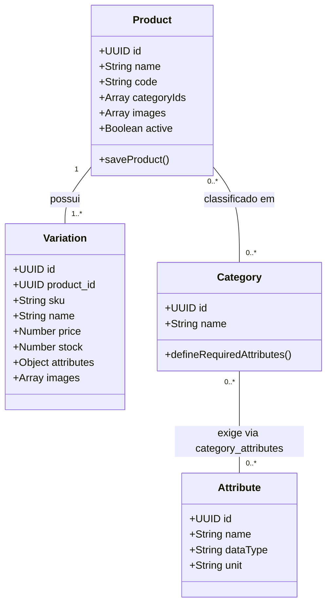

# Estrutura de Produtos e Variações — Morante Hub

Este documento especifica o modelo conceitual de produtos e variações, a regra de variação principal única, a obrigatoriedade de UUID e a gestão de SKUs.

---

## 🧩 Modelo Único "Todo Produto Possui Variação"

No Morante Hub, a arquitetura de catálogo é estritamente uniformizada:
1. **Produto Simples**: É um produto pai que possui exatamente **1 variação única principal** (criada automaticamente por `ensureDefaultVariation`).
2. **Produto Composto / Com Variações**: É um produto pai que possui **2 ou mais variações** (ex: Cores, Tamanhos, Medidas).

## Atributos obrigatórios por Categoria

- `attributes` e `attribute_values` são o cadastro global de atributos e opções. A criação e administração desses registros permanece no fluxo próprio de gerenciamento de atributos.
- `category_attributes` é a fonte de verdade para definir quais atributos são obrigatórios em cada Categoria. O vínculo pertence à Categoria e não é multiplicado pelos Ambientes aos quais ela está associada.
- O valor efetivo continua armazenado em `product_variations.attributes`, inclusive para o produto simples, que possui sua variação principal única.
- Associar um Produto a uma Categoria ou adicionar uma nova obrigatoriedade não inventa nem preenche valores. Variações sem valor passam a ter uma pendência na Central de Conciliação.
- Remover uma linha de obrigatoriedade em `category_attributes` não remove nem altera valores já existentes em `product_variations.attributes`.

## Visibilidade do atributo no nome da Variação

- Cada item de `product_variations.attributes` pode persistir `showName: false` para manter o atributo disponível para filtros e regras sem incluir seu valor no nome automático da variação.
- A ausência de `showName` equivale a `true`. Assim, produtos e variações cadastrados antes dessa opção continuam exibindo todos os valores no nome, sem backfill.
- A visibilidade altera somente a composição de `name`, `title` e `marketplaceTitle`; o atributo e seu valor continuam persistidos e participam da identificação de combinações duplicadas.
- A ordem dos valores visíveis segue a ordem dos atributos na aba **Identificação e Atributos**.

### Mapeamento em código e testes

- Configuração da Categoria: `categoryService.ts` e `CategoryEnvironmentModal.tsx`.
- Detecção na Conciliação: `Reconciliation/services/pendencyDetector.ts`.
- Correção de valores: `ReconciliationProductCard.tsx` e `VariationAttributeValueInput.tsx`.
- Regressão: `categories-deletion-safety.spec.ts` e `pendencyDetector.test.ts`.
- Visibilidade no nome: `productVariationDefaults.ts`, `VariationIdentificationTab.tsx` e seus testes unitários.

---

## 🆔 Identidade por UUID

- **Chave Primária Fixo (UUID)**: O campo `id` da tabela `product_variations` é a **única chave primária confiável da variação**.
- **SKU Comercial (`sku`)**: O SKU é o código alfanumérico visível nas etiquetas e relatórios. Se um usuário alterar o SKU comercial de uma variação, a alteração é aceita contanto que o SKU seja único no banco, mantendo a variação com o **mesmo `UUID`**.

---

## 🏷️ Códigos dos Fornecedores (`supply_product_links` / `product_supplier_codes`)

Um produto ou variação pode ser adquirido de múltiplos fornecedores ou ter seu código alterado por um fornecedor ao longo do tempo:
- **Tuplas Únicas**: Cada vinculo é salvo como uma tupla `(supplier_id, supplier_product_code)` na tabela `product_supplier_codes`.
- **Múltiplos Códigos por Fornecedor**: O mesmo fornecedor pode ter 2 ou mais códigos associados à mesma variação no ERP (ex: código legado vs. código atualizado no XML de compra).
- **Resolução Automática**: Na entrada de NF-e, qualquer código histórico cadastrado para aquele fornecedor realiza o auto-match automático com a variação correspondente.

---

## 🔗 Mapeamento em Código e Testes

- **Serviço de Códigos de Fornecedores**: `[productSupplierCodesService.ts](file:///c:/Users/mathe/OneDrive/%C3%81rea%20de%20Trabalho/projetos/morantehub/erp/src/pages/utils/productSupplierCodesService.ts)`
- **Serviço de Mutação**: `[productMutationService.ts](file:///c:/Users/mathe/OneDrive/%C3%81rea%20de%20Trabalho/projetos/morantehub/erp/src/pages/utils/productService/productMutationService.ts)`
- **Sincronização Supabase**: `[productPersistenceService.ts](file:///c:/Users/mathe/OneDrive/%C3%81rea%20de%2520Trabalho/projetos/morantehub/erp/src/pages/utils/productService/productPersistenceService.ts)`
- **Padronização de Variações**: `[productVariationDefaults.ts](file:///c:/Users/mathe/OneDrive/%C3%81rea%20de%20Trabalho/projetos/morantehub/erp/src/pages/utils/productVariationDefaults.ts)`
- **Relatório de Auditoria**: `[2026-09-09-identidade-variacao-uuid.md](file:///c:/Users/mathe/OneDrive/%C3%81rea%20de%20Trabalho/projetos/morantehub/docs/auditorias/2026-09-09-identidade-variacao-uuid.md)`
