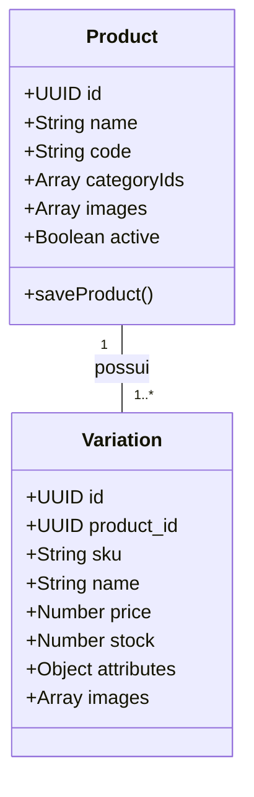

# Estrutura de Produtos e Variações — Morante Hub

Este documento especifica o modelo conceitual de produtos e variações, a regra de variação principal única, a obrigatoriedade de UUID e a gestão de SKUs.

---

## 🧩 Modelo Único "Todo Produto Possui Variação"

No Morante Hub, a arquitetura de catálogo é estritamente uniformizada:
1. **Produto Simples**: É um produto pai que possui exatamente **1 variação única principal** (criada automaticamente por `ensureDefaultVariation`).
2. **Produto Composto / Com Variações**: É um produto pai que possui **2 ou mais variações** (ex: Cores, Tamanhos, Medidas).

---

## 🆔 Identidade por UUID

- **Chave Primária Fixo (UUID)**: O campo `id` da tabela `product_variations` é a **única chave primária confiável da variação**.
- **SKU Comercial (`sku`)**: O SKU é o código alfanumérico visível nas etiquetas e relatórios. Se um usuário alterar o SKU comercial de uma variação, a alteração é aceita contanto que o SKU seja único no banco, mantendo a variação com o **mesmo `UUID`**.

---

## 🏷️ Códigos dos Fornecedores (`supply_product_links` / `product_supplier_codes`)

Um produto ou variação pode ser adquirido de múltiplos fornecedores ou ter seu código alterado por um fornecedor ao longo do tempo:
- **Tuplas Únicas**: Cada vinculo é salvo como uma tupla `(supplier_id, supplier_product_code)` na tabela `product_supplier_codes`.
- **Múltiplos Códigos por Fornecedor**: O mesmo fornecedor pode ter 2 ou mais códigos associados à mesma variação no ERP (ex: código legado vs. código atualizado no XML de compra).
- **Resolução Automática**: Na entrada de NF-e, qualquer código histórico cadastrado para aquele fornecedor realiza o auto-match automático com a variação correspondente.

---

## 🔗 Mapeamento em Código e Testes

- **Serviço de Códigos de Fornecedores**: `[productSupplierCodesService.ts](file:///c:/Users/mathe/OneDrive/%C3%81rea%20de%20Trabalho/projetos/morantehub/erp/src/pages/utils/productSupplierCodesService.ts)`
- **Serviço de Mutação**: `[productMutationService.ts](file:///c:/Users/mathe/OneDrive/%C3%81rea%20de%20Trabalho/projetos/morantehub/erp/src/pages/utils/productService/productMutationService.ts)`
- **Sincronização Supabase**: `[productPersistenceService.ts](file:///c:/Users/mathe/OneDrive/%C3%81rea%20de%2520Trabalho/projetos/morantehub/erp/src/pages/utils/productService/productPersistenceService.ts)`
- **Padronização de Variações**: `[productVariationDefaults.ts](file:///c:/Users/mathe/OneDrive/%C3%81rea%20de%20Trabalho/projetos/morantehub/erp/src/pages/utils/productVariationDefaults.ts)`
- **Relatório de Auditoria**: `[2026-09-09-identidade-variacao-uuid.md](file:///c:/Users/mathe/OneDrive/%C3%81rea%20de%20Trabalho/projetos/morantehub/docs/auditorias/2026-09-09-identidade-variacao-uuid.md)`

