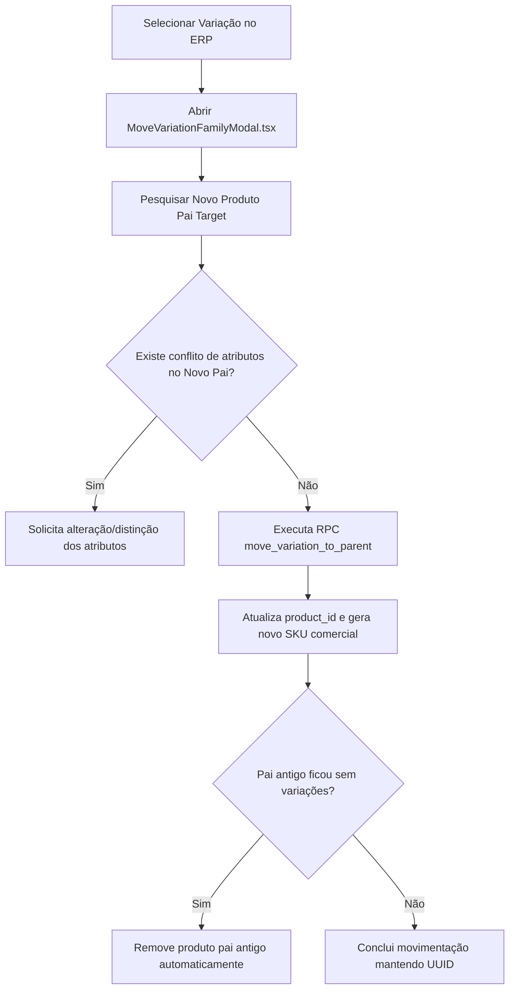
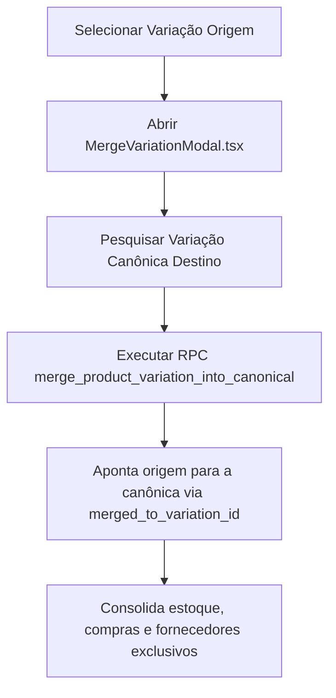

# Operações Avançadas: Mover Pai e Merge de Variações — Morante Hub

Este documento descreve as operações avançadas de reestruturação de produtos no Morante Hub: a transferência de uma variação para outro produto pai e a mesclagem (merge) de variações duplicadas.

---

## 🔀 Operação 1: Mover Variação para Outro Pai (`moveVariationToFamily`)

### Objetivo
Permite reatribuir o produto pai (`product_id`) de uma variação sem alterar seu `UUID`, preservando integralmente o histórico de vendas, estoque e movimentações.

---

## 🔀 Operação 2: Mesclar Variações (`mergeVariationIntoCanonical`)

### Objetivo
Unificar cadastros duplicados de uma mesma variação. A variação não-canônica (origem) repassa suas informações e associações para a variação canônica (destino).

---

## 🔗 Mapeamento em Código e Testes

- **Serviço de Variações**: `[productVariationActionsService.ts](file:///c:/Users/mathe/OneDrive/%C3%81rea%20de%20Trabalho/projetos/morantehub/erp/src/pages/utils/productService/productVariationActionsService.ts)`
- **Modal Mover Pai**: `[MoveVariationFamilyModal.tsx](file:///c:/Users/mathe/OneDrive/%C3%81rea%20de%20Trabalho/projetos/morantehub/erp/src/pages/App/Products/ProductList/MoveVariationFamilyModal.tsx)`
- **Modal Merge**: `[MergeVariationModal.tsx](file:///c:/Users/mathe/OneDrive/%C3%81rea%20de%20Trabalho/projetos/morantehub/erp/src/pages/App/Products/ProductList/MergeVariationModal.tsx)`
