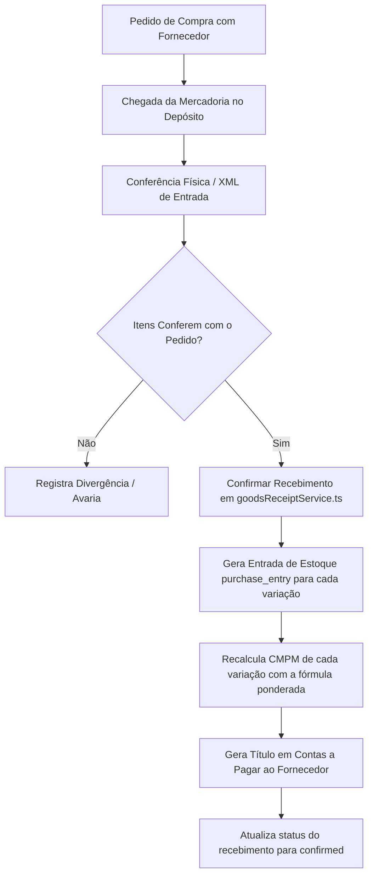

# Recebimento de Compras e Entrada de Estoque — Morante Hub

Este documento descreve o fluxo de conferência, confirmação física de compras de fornecedores, atualização de saldos, recálculo de CMPM e lançamento no contas a pagar.

---

## 🚛 Fluxo Completo de Recebimento de Compra

---

## 📋 Regras de Atualização de Custo no Recebimento

1. **Inclusão de Custos Adicionais (Frete e Seguro)**:
   - Se o recebimento contiver frete ou despesas acessórias de compra, estes custos são rateados proporcionalmente ao valor de cada item para compor o **custo final de aquisição unitário (`finalUnitCost`)**.
2. **Impacto Imediato no Estoque**:
   - Assim que o recebimento é confirmado, a quantidade entrada fica imediatamente disponível para vendas e entregas no ERP e App Mobile.

---

## 🔗 Mapeamento em Código e Testes

- **Orquestrador de Recebimentos**: `[goodsReceiptService.ts](file:///c:/Users/mathe/OneDrive/%C3%81rea%20de%20Trabalho/projetos/morantehub/erp/src/pages/utils/goodsReceiptService.ts)`
- **Resolução de Status**: `[goodsReceiptStatus.ts](file:///c:/Users/mathe/OneDrive/%C3%81rea%20de%20Trabalho/projetos/morantehub/erp/src/pages/utils/goodsReceiptStatus.ts)`
- **Testes de Proteção**: `[goodsReceiptCostCalculation.test.ts](file:///c:/Users/mathe/OneDrive/%C3%81rea%20de%20Trabalho/projetos/morantehub/erp/src/pages/utils/goodsReceiptCostCalculation.test.ts)`
