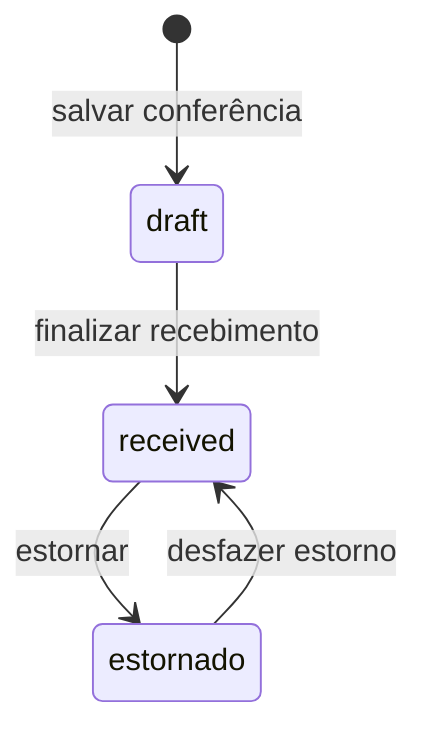

# Recebimento de Compras — Morante Hub

Um recebimento confirma a chegada física de mercadoria e cria uma entrada de estoque por item vinculado ao catálogo. Seus estados são `draft`, `received` e `estornado`.

## Pedido de compra como referência

O pedido de compra registra apenas o planejado com o fornecedor: itens, quantidades, valores esperados e condições comerciais. Ele **não** cria movimentos de estoque, não altera saldo e não recalcula o CMPM.

Ao abrir um novo recebimento, o usuário pode selecionar um pedido de compra para preencher fornecedor e itens. O identificador do pedido é preservado como referência no recebimento. A conferência do que chegou, inclusive divergências de quantidade e custo, ocorre no recebimento. Somente sua finalização efetiva as entradas de estoque.

## Finalização

Ao finalizar, o sistema:

1. grava o cabeçalho em `goods_receipts` e os itens normalizados em `goods_receipt_items`;
2. cria uma `inventory_move` `entry`, `effective`, para cada item com produto vinculado;
3. armazena o ID da movimentação no snapshot do item (`inventoryMoveId`) e o vincula ao recebimento;
4. usa o custo unitário calculado após rateios fiscais e não fiscais para atualizar o CMPM da variação.

Itens sem produto vinculado não geram entrada de estoque até serem conciliados. O recebimento preserva o snapshot do item e seus componentes de custo (base, frete, desconto e despesas).

## Estorno e desfazimento

Estornar não cria uma nova saída artificial. O sistema marca as entradas vinculadas como `reversed`, preservando os fatos e recompondo o saldo. O estorno busca primeiro os `inventoryMoveId` gravados no item e também procura movimentos ligados ao recebimento para cobrir registros legados.

Desfazer o estorno reativa esses movimentos como `effective`. Somente se um recebimento legado não tiver movimento recuperável, novas entradas são criadas e seus IDs são registrados nos itens.

## Implementação e testes

- [Serviço de recebimentos](../../../erp/src/pages/utils/goodsReceiptService.ts)
- [Cálculo e persistência de estoque](../../../erp/src/pages/utils/inventoryService.ts)
- [Teste de desfazer estorno](../../../erp/src/pages/App/Stock/Receipts/utils/goodsReceiptUnreverse.test.ts)
## Integridade transacional

A confirmação de um recebimento persistido usa a RPC `confirm_goods_receipt_transaction`. Ela bloqueia o recebimento, grava cabeçalho, itens normalizados e as entradas de estoque na mesma transação. O par `source_receipt_id` e `source_item_index` torna o reenvio idempotente: repetir a confirmação devolve a movimentação já criada e não aumenta o saldo.

O estorno e seu desfazimento usam `set_goods_receipt_inventory_status_transaction`; ambos alteram o status do recebimento e de todas as movimentações identificadas pelo recebimento no mesmo commit. Não há busca por texto de fornecedor, nota ou descrição para localizar movimentos novos.
