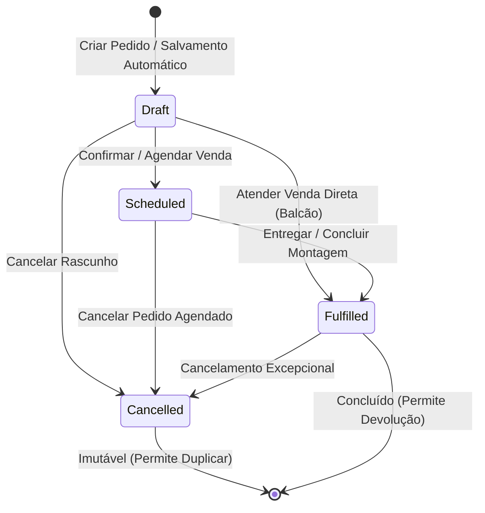

# Ciclo de Vida de Pedidos e Vendas — Morante Hub

Este documento descreve os estados, máquinas de estado, transições e regras operacionais do ciclo de vida dos pedidos de venda no Morante Hub.

---

## 🔄 Máquina de Estados do Pedido (`stateDiagram-v2`)

---

## 📋 Descrição dos Estados

| Status | Nome no Sistema | Descrição Operacional | Efeito em Estoque | Efeito Financeiro |
| :--- | :--- | :--- | :--- | :--- |
| `draft` | **Rascunho / Orçamento** | Pedido em digitação ou orçamento preliminar. Não gera reserva nem baixa. | Nenhum | Nenhum |
| `scheduled` | **Agendado** | Venda confirmada com data de entrega/montagem programada. | Saída efetiva na data do pedido (`order.date`) | Título a receber pendente |
| `fulfilled` | **Atendido** | Venda entregue e concluída ao cliente. | Saída efetiva mantida, CMV materializado | Título a receber liquidado/confirmado |
| `cancelled` | **Cancelado** | Venda interrompida/cancelada. | Estorna saída se `stockProcessed` era `true` | Cancela títulos a receber pendentes |

---

## 🔒 Regras de Transição e Validação

1. **Rascunho → Agendado / Atendido**:
   - Valida obrigatoriedade de cliente, itens e condições de pagamento via `validateOrder()`.
   - Dispara a gestão de estoque em `[orderStockOperations.ts](file:///c:/Users/mathe/OneDrive/%C3%81rea%20de%20Trabalho/projetos/morantehub/erp/src/pages/utils/orderStockOperations.ts)`.
   - Gera notificação de venda e montagens via `notifyNewSaleAndAssemblies()`.
2. **Proibição de Retorno a Rascunho**:
   - Um pedido que já passou para `scheduled` ou `fulfilled` **NUNCA** pode retornar ao status `draft`.
3. **Imutabilidade do Status Cancelado**:
   - Um pedido cancelado não aceita edições de status. Para reaproveitar as informações, a interface disponibiliza o recurso `Duplicar Pedido`.

---

## 🔗 Referências de Código e Testes

- **Serviço Principal**: `[orderHistoryService.ts](file:///c:/Users/mathe/OneDrive/%C3%81rea%20de%20Trabalho/projetos/morantehub/erp/src/pages/utils/orderHistoryService.ts)` → `saveOrder()`, `updateOrder()`
- **Resolução de Status**: `[orderSchedulingStatus.ts](file:///c:/Users/mathe/OneDrive/%C3%81rea%20de%20Trabalho/projetos/morantehub/erp/src/pages/utils/orderSchedulingStatus.ts)` → `resolveCompletedOrderStatus()`
- **Testes Automatizados**: `[duplicateOrder.test.ts](file:///c:/Users/mathe/OneDrive/%C3%81rea%20de%20Trabalho/projetos/morantehub/erp/src/pages/utils/duplicateOrder.test.ts)`
