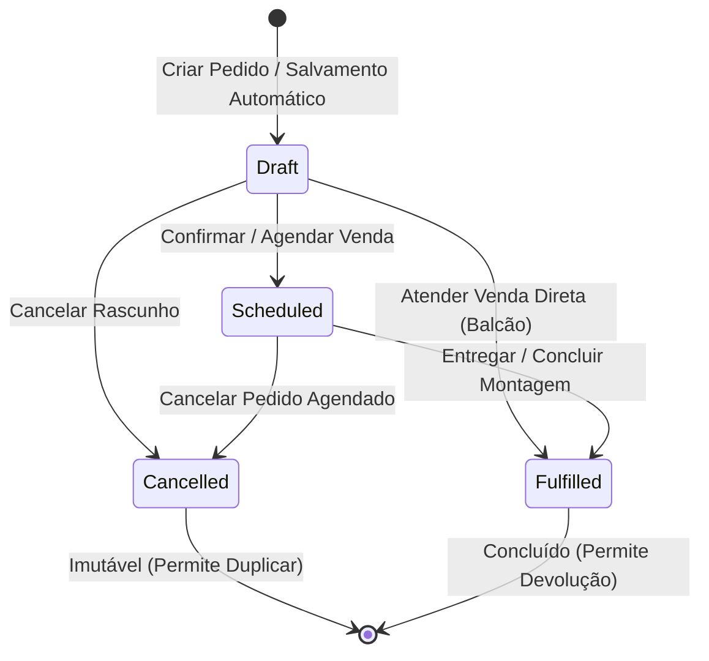

# Ciclo de Vida de Pedidos e Vendas — Morante Hub

Este documento descreve os estados, máquinas de estado, transições e regras operacionais do ciclo de vida dos pedidos de venda no Morante Hub.

---

## 🔄 Máquina de Estados do Pedido (`stateDiagram-v2`)

```mermaid
stateDiagram-v2
    [*] --> Draft: Criar Pedido / Salvamento Automático
    
    Draft --> Scheduled: Confirmar / Agendar Venda
    Draft --> Fulfilled: Atender Venda Direta (Balcão)
    Draft --> Cancelled: Cancelar Rascunho
    
    Scheduled --> Fulfilled: Entregar / Concluir Montagem
    Scheduled --> Cancelled: Cancelar Pedido Agendado
    
    
    Cancelled --> [*]: Imutável (Permite Duplicar)
    Fulfilled --> [*]: Concluído (Permite Devolução)
```

---

## 📋 Descrição dos Estados

| Status | Nome no Sistema | Descrição Operacional | Efeito comercial/estoque |
| :--- | :--- | :--- | :--- |
| `draft` | **Rascunho / Orçamento** | Pedido em digitação ou orçamento preliminar. Não gera baixa de estoque. | Sem movimentação de saída. |
| `scheduled` | **Agendado** | Venda confirmada com data de entrega/montagem programada. | A saída segue o gatilho comercial/estoque do pedido. Cancelamento só se não houver circulação. |
| `fulfilled` | **Atendido** | Entrega ou retirada confirmada. Conta como circulação para a política fiscal. | Preserva a saída confirmada; eventual retorno físico segue devolução vinculada. |
| `cancelled` | **Cancelado** | Cancelamento comercial permitido quando não houve circulação. | Reverte os efeitos de estoque dentro da operação transacional; eventual tratamento fiscal é decidido pela política central após o commit. |

---

## 🔒 Regras de Transição e Validação

1. **Rascunho → Agendado / Atendido**:
   - Valida obrigatoriedade de cliente, itens e condições de pagamento via `validateOrder()`.
   - Dispara a gestão de estoque em [orderStockOperations.ts](../../../erp/src/pages/utils/orderStockOperations.ts).
   - Gera notificação de venda e montagens via `notifyNewSaleAndAssemblies()`.
2. **Cancelamento antes da circulação**:
   - Pedido e efeitos de estoque são atualizados pela operação transacional compartilhada.
   - Se houver documento fiscal autorizado, a política escolhe automaticamente cancelamento SEFAZ dentro do prazo ou estorno quando permitido; sem documento autorizado, não há evento fiscal.
3. **Depois da circulação**:
   - `fulfilled` cobre entrega e retirada confirmadas. Não cancelar como operação não realizada nem gerar estorno; preservar a NF-e original e usar devolução vinculada após o retorno físico.
   - A ação “Corrigir atendimento/retirada” pode retornar `fulfilled` para `scheduled`, mas o guard atual não verifica se houve circulação física. Não usar essa correção após entrega/retirada confirmada; a lacuna e o risco de cancelamento subsequente estão no [status fiscal](../../fiscal/status-testes-homologacao.md).
4. **Proibição de Retorno a Rascunho**:
   - Um pedido que já passou para `scheduled` ou `fulfilled` **NUNCA** pode retornar ao status `draft`.
5. **Imutabilidade do Status Cancelado**:
   - Um pedido cancelado não aceita edições de status. Para reaproveitar as informações, a interface disponibiliza o recurso `Duplicar Pedido`.

---

## 🔗 Referências de Código e Testes

- **Serviço Principal**: [orderHistoryService.ts](../../../erp/src/pages/utils/orderHistoryService.ts) → `saveOrder()`, `updateOrder()`
- **Resolução de Status**: [orderSchedulingStatus.ts](../../../erp/src/pages/utils/orderSchedulingStatus.ts) → `resolveCompletedOrderStatus()`
- **Regras de cancelamento, estorno e devolução**: [documento operacional](cancelamentos-reversoes.md), [status fiscal atual](../../fiscal/status-testes-homologacao.md) e [auditoria de cancelamento de 08/10](../../fiscal/auditoria-cancelamento-estorno-devolucao-2026-10-08.md)
- **Testes Automatizados**: [duplicateOrder.test.ts](../../../erp/src/pages/utils/__tests__/duplicateOrder.test.ts)
