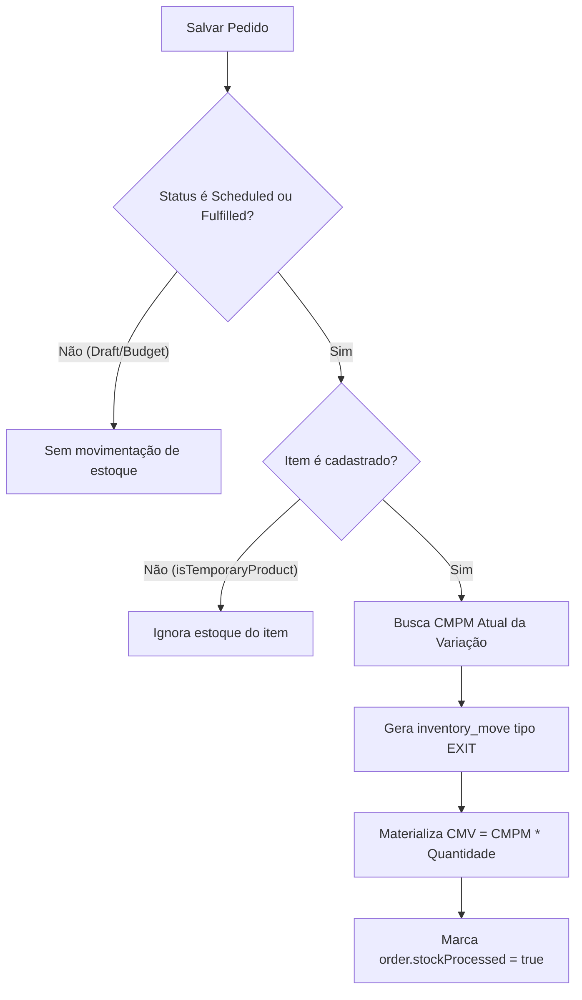

# Regras de Estoque e CMV em Vendas — Morante Hub

Este documento especifica a mecânica de movimentação de estoque, cálculo e congelamento do Custo de Mercadoria Vendida (CMV) em vendas.

---

## ⚡ Regras Fundamentais de Estoque em Vendas

### 1. Data Efetiva da Movimentação (`order.date`)
- Toda venda agendada (`scheduled`) ou atendida (`fulfilled`) gera uma saída de estoque cuja **data de movimentação efetiva** é exatamente a data de cadastro do pedido (`order.date`).
- Isso garante alinhamento de competência contábil e curva de vendas no DRE.

### 2. CMV Materializado e Imutável
- O CMV da venda é calculado multiplicando a quantidade vendida pelo **Custo Médio Ponderado Móvel (CMPM)** vigente da variação no momento exato em que a saída é processada.
- O valor do CMV é gravado no registro da movimentação (`inventory_moves.unit_cost`) e no snapshot do pedido. Reajustes futuros no custo de aquisição do produto **NÃO** recalculam retroativamente o CMV de vendas já finalizadas.

### 3. Tratativa de Produtos Sem Cadastro (`isTemporaryProduct`)
- Itens de venda cadastrados temporariamente ou sem vínculo de produto (`productId` ausente ou `isTemporaryProduct: true`):
  - **NUNCA** geram saída automática de estoque;
  - **NUNCA** geram lançamento de CMV artificial.
- Quando o produto é posteriormente conciliado na edição do pedido (`OrderEditModal` -> Conciliação Comercial), o vínculo com o produto cadastrado é estabelecido.

---

## 🔄 Fluxo de Processamento de Estoque em Venda

---

## 🔗 Mapeamento em Código e Testes

- **Serviço de Regras**: `[saleInventoryRules.ts](file:///c:/Users/mathe/OneDrive/%C3%81rea%20de%20Trabalho/projetos/morantehub/erp/src/pages/utils/saleInventoryRules.ts)` → `isStockEligibleSaleItem()`
- **Sincronização de Itens**: `[saleItemInventorySync.ts](file:///c:/Users/mathe/OneDrive/%C3%81rea%20de%20Trabalho/projetos/morantehub/erp/src/pages/utils/saleItemInventorySync.ts)` → `reverseSaleItemMoves()`
- **Testes de Proteção**: `[latestRulesBattery.test.ts](file:///c:/Users/mathe/OneDrive/%C3%81rea%20de%20Trabalho/projetos/morantehub/erp/src/pages/utils/latestRulesBattery.test.ts)`
