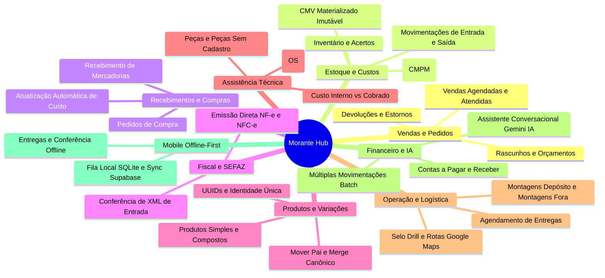

# Visão Geral do Negócio — Morante Hub

O **Morante Hub** é um ecossistema integrado de ERP (Gestão Empresarial) e Aplicativo Mobile Offline-First projetado para operações comerciais de móveis, eletrodomésticos, montagens, assistência técnica e serviços logísticos.

---

## 🎯 Domínios de Negócio Principais

O sistema é estruturado em 9 domínios operacionais interconectados:

---

## 🔑 Conceitos Chave do Sistema

1. **Vendas (`orders`)**: Representam transações com clientes. Podem ser do tipo `sale` (venda), `budget` (orçamento), `assistance` (assistência), `return` (devolução) ou `showroom` (exposição).
2. **Produtos e Variações (`products` / `product_variations`)**: Todo produto cadastrado possui pelo menos uma variação. Produtos simples são sua própria variação única principal. A identidade de uma variação é estritamente vinculada ao seu `UUID`.
3. **Movimentação de Estoque (`inventory_moves`)**: Registros imutáveis de entradas, saídas, devoluções, perdas ou acertos. O saldo do produto é o acumulado histórico das movimentações efetivas.
4. **Custo Médio Ponderado Móvel (CMPM)**: Recalculado automaticamente a cada entrada de compra ou recebimento físico de fornecedor.
5. **Custo de Mercadoria Vendida (CMV)**: Gravado no momento exato em que a venda gera saída de estoque e permanece **imutável** para proteger DREs e relatórios históricos de lucro.
6. **Snapshots Imutáveis no Pedido**: Nome do produto, preço unitário, endereço e dados do cliente são gravados em snapshot no pedido para que edições futuras em cadastros não alterem vendas passadas.
